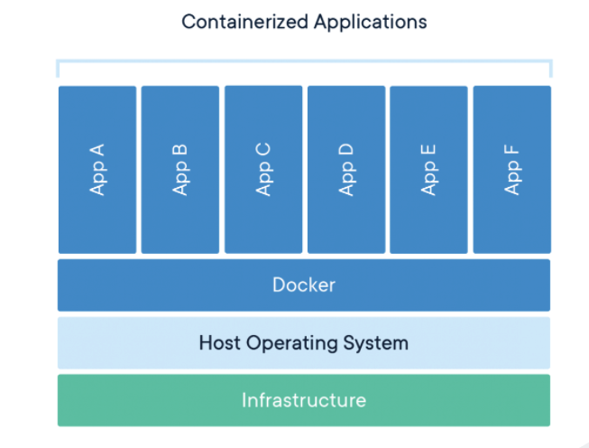
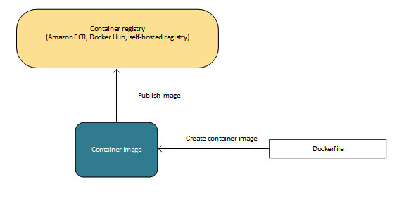
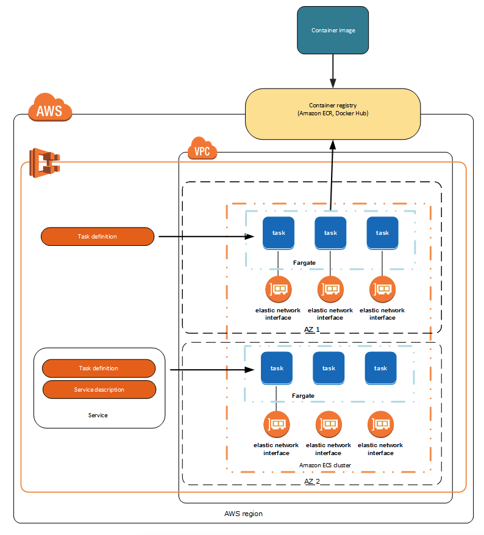

# Containers on AWS

## What is a Container?

A container is a standardized unit of software development that contains everything that your software application needs to run, including relevant code, runtime, system tools, and system libraries. Containers are created from a read-only template called an image.

Images are typically built from a Dockerfile, which is a plaintext file that specifies all of the components that are included in the container. After being built, these images are stored in a registry where they then can be downloaded and run on your cluster. For more information about container technology, see Docker basics for Amazon ECS.

Multiple docker containers can run on an operating system using docker.

### Dockerfiles, Images, Containers

A **dockerfile** specifies the resources for a **docker image**, you *build* the dockerfile to create a docker image. 

* The dockerfile is just a text file. 
* The docker image is like a template for the actual container.
* When you *run* a docker image, you have a container.

Container images are stored in a container registry. The container images that ECS runs to create containers come from a container registry. Some popular registry options are Amazon ECR, Docker Hub, GitHub Container Registry, or self-hosted.

## What is Amazon Elatic Container Service?

Amazon Elastic Container Service is for managing containers on AWS. There are two ways to run ECS, Fargate (EC2) or ontop of EC2 instances that you manage.

Here is a diagram.

Let's explain what all this means.

### Task definitions, tasks

**Task definitions** describe the containers that form your application. It also defines other parameters like what ports should be open and what data volumes should be used with the task.

A **task** is an instantiation of a task definition. Multiple identical tasks can be created from a task definition.

The diagram below is complicated, let's break it down.

* A container image is uploaded to a container registry.
* This container is running on Fargate, so there are no EC2 instances in the diagram.
* The task definition can create multiple identical tasks.
  * Each task can run multiple docker containers within.

## Fargate vs. EC2 Backed

Containers are run on clusters, which are logical groupings of tasks. 

There are two ways to run a cluster:

* **AWS Fargate**: You don't have to manage the underlying EC2 instances.
* **EC2 backed**: You can manage the backing EC2 instances.