# AWS Solutions Architect Associate Notes 

<details>
  <summary><a href="#tutorial">Tutorial</a></summary>
    
* [Using the electronic book](#using-the-electronic-book)
* [Contributing to the problem bank](#contributing-to-the-problem-bank)
</details>

<details>
  <summary><a href="#aws-global-infrastructure">AWS Global Infrastructure</a></summary>
    
* [Traditional Data Centers](#traditional-data-centers)
* [AWS vs. Traditional Data Centers](#aws-vs-traditional-data-centers)
* [Global Infrastructure](#global-infrastructure)
</details>

<details>
  <summary><a href="#ec2">EC2</a></summary>
    
* [What is Amazon EC2](#what-is-amazon-ec2)
* [AMI](#ami)
* [Instance IP Addressing](#instance-ip-addressing)
* [User data scripts](#user-data-scripts)
* [Instance purchasing options](#instance-purchasing-options)
* [More on Spot Instances](#more-on-spot-instances)
* [EC2 Instance Types](#ec2-instance-types)
* [Placement groups](#placement-groups)
* [Network Interfaces](#network-interfaces)
</details>

<details>
  <summary><a href="#networking-basics">Networking Basics</a></summary>
    
* [IPv4](#ipv4)
* [CIDR](#cidr)
* [Private Addresses](#private-addresses)
</details>

<details>
  <summary><a href="#vpc">VPC</a></summary>
    
* [VPC Basics](#vpc-basics)
* [Subnet Sizing](#subnet-sizing)
* [Route Tables](#route-tables)
* [Internet Gateway](#internet-gateway)
* [NAT devices](#nat-devices)
* [Egress-only internet gateways](#egress-only-internet-gateways)
* [Security Groups](#security-groups)
* [Network ACL (Network Access Control List)](#network-acl-network-access-control-list)
* [VPC Endpoints](#vpc-endpoints)
* [AWS PrivateLink (VPC endpoint services)](#aws-privatelink-vpc-endpoint-services)
* [VPC Peering](#vpc-peering)
* [Bastion Hosts](#bastion-hosts)
* [What is a VPN?](#what-is-a-vpn)
* [Site to Site VPN Connection](#site-to-site-vpn-connection)
* [Transit Gateway](#transit-gateway)
* [Direct Connect](#direct-connect)
* [VPN CloudHub](#vpn-cloudhub)
* [VPC Flow Logs](#vpc-flow-logs)
</details>

<details>
  <summary><a href="#auto-scaling">Auto Scaling</a></summary>
    
* [What is Amazon EC2 Auto Scaling?](#what-is-amazon-ec2-auto-scaling)
* [Auto scaling benefits](#auto-scaling-benefits)
* [Dynamic Scaling Policy Types](#dynamic-scaling-policy-types)
* [Scaling Cooldowns](#scaling-cooldowns)
* [Scheduled Scaling](#scheduled-scaling)
* [Lifecycle Hooks](#lifecycle-hooks)
* [Health Checks](#health-checks)
</details>

<details>
  <summary><a href="#elastic-load-balancing">Elastic Load Balancing</a></summary>
    
* [What is Elastic Load Balancing?](#what-is-elastic-load-balancing)
* [ALB](#alb)
* [NLB](#nlb)
* [Cross-zone load balancing](#cross-zone-load-balancing)
</details>

<details>
  <summary><a href="#ebs">EBS</a></summary>
    
* [What is EBS?](#what-is-ebs)
* [Instance Types](#instance-types)
* [Snapshots](#snapshots)
* [Encryption](#encryption)
</details>

<details>
  <summary><a href="#s3">S3</a></summary>
    
* [Buckets](#buckets)
* [Objects](#objects)
* [Data Consistency](#data-consistency)
* [Encryption](#encryption-1)
* [Managing Access](#managing-access)
* [CORS](#cors)
* [Versioning](#versioning)
* [Storage Classes](#storage-classes)
* [Lifecycle Transitions](#lifecycle-transitions)
* [Optimizing Performance](#optimizing-performance)
</details>

<details>
  <summary><a href="#databases">Databases</a></summary>
    
* [What is a database?](#what-is-a-database)
* [Amazon Relational Database Service (RDS)](#amazon-relational-database-service-rds)
* [Aurora](#aurora)
* [Amazon DynamoDB](#amazon-dynamodb)
* [Amazon Redshift](#amazon-redshift)
* [Elasticache](#elasticache)
* [Other Databases](#other-databases)
</details>

<details>
  <summary><a href="#amazon-simple-notification-service-sns">Amazon Simple Notification Service (SNS)</a></summary>
    
* [What is SNS?](#what-is-sns)
* [Fanout pattern](#fanout-pattern)
* [FIFO](#fifo)
* [Message Filtering](#message-filtering)
</details>

<details>
  <summary><a href="#amazon-simple-queue-service-sqs">Amazon Simple Queue Service (SQS)</a></summary>
    
* [What is SQS?](#what-is-sqs)
* [Standard vs. FIFO](#standard-vs-fifo)
* [Configuration](#configuration)
* [Access Policy](#access-policy)
* [Server-side encryption](#server-side-encryption)
* [Dead-letter queue](#dead-letter-queue)
</details>

<details>
  <summary><a href="#amazon-kinesis">Amazon Kinesis</a></summary>
    
* [What is Kinesis?](#what-is-kinesis)
* [Kinesis Data Streams](#kinesis-data-streams)
* [Kinesis Data Firehose](#kinesis-data-firehose)
* [Kinesis Data Analytics](#kinesis-data-analytics)
</details>

<details>
  <summary><a href="#cloudwatch">Cloudwatch</a></summary>
    
* [What is CloudWatch?](#what-is-cloudwatch)
* [Metrics](#metrics)
* [Dashboards](#dashboards)
* [Logs](#logs)
* [High-Resolution Metrics](#high-resolution-metrics)
* [EC2](#ec2-1)
* [Using Amazon CloudWatch dashboards](#using-amazon-cloudwatch-dashboards)
* [Alarms](#alarms)
</details>

<details>
  <summary><a href="#containers-on-aws">Containers on AWS</a></summary>
    
* [What is a Container?](#what-is-a-container)
* [What is Amazon Elatic Container Service?](#what-is-amazon-elatic-container-service)
* [Fargate vs. EC2 Backed](#fargate-vs-ec2-backed)
</details>

<details>
  <summary><a href="#snow">Snow</a></summary>
    
* [What is the AWS Snow Family?](#what-is-the-aws-snow-family)
</details>


# Tutorial

## Using the electronic book

We have software for hosting electronic books that lets you solve problems and track your progress.

[](https://www.youtube.com/watch?v=t7Kuv6EJdrw)

## Contributing to the problem bank

The content in this book is licensed under Creative Commons Attribution-ShareAlike 4.0 International License and is primarily based on the AWS documentation.

The problems in this book are licensed CC0, meaning that you can do whatever you want with them without any attribution. Problems are embedded as YAML blocks in the content of the book and processed into interactive components. A machine-readable bank of all problems in the entire book can be found in the [problems.yaml](https://github.com/MatthewCaseres/AWS-Notes/blob/main/problems.yaml) file of the repository.

Our software for electronic books is also licensed CC0.

[](https://www.youtube.com/watch?v=HJ2flqIud8Q)

# AWS Global Infrastructure

## Traditional Data Centers

Before cloud computing companies had to manage physical computation resources themselves. This meant a room full of servers, cables, and people that needed to understand how all of these things worked. This room is called a data center.

## AWS vs. Traditional Data Centers

With AWS you are paying to use Amazon's machines. They manage the data centers, not you.

One advantage of this is that you can just pay for what you need. In the past companies would have to commit to buying servers. This is a big commitment, and it would be easy to overestimate or underestimate your needs.

You might not have money to buy servers. You might only need them for one month of the year, or one hour of the day. This is why it is better to just pay for what you need with AWS.

## Global Infrastructure

AWS has lots of data centers so that it can meet the needs of huge companies like Amazon and Netflix.

A cluster of data centers is called a **region**. Within this cluster there are more clusters called availability zones.

The reason for having physically separate availability zones is that the region is more fault-tolerant in case of a natural disaster.

Availabilty zones within a region are connected with redundant, high-bandwidth, low-latency networking. Data centers within the availability zone are also connected.

# EC2

## What is Amazon EC2

Amazon EC2 lets you run servers in the cloud. Before the cloud you would have a physical server, now you can just rent one from Amazon.

## AMI

When you launch an instance you select an Amazon Machine Image (AMI) which packages up an operating system and any additional software you will need for your server. Below is an image of part of the selection menu, see that we can select a Linux or Windows instance type.

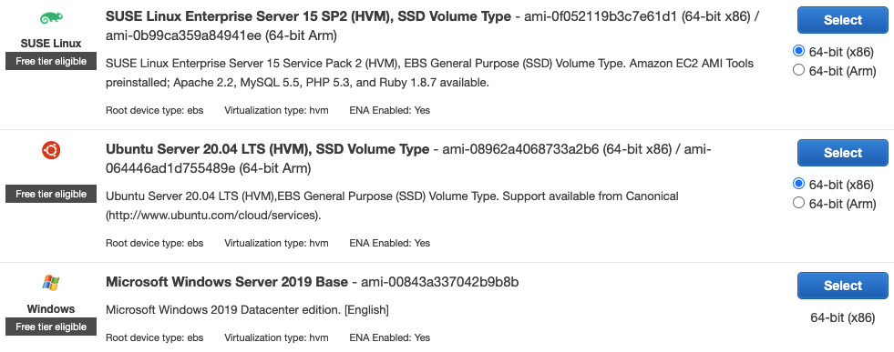

If you start with a basic AMI and customize it for your needs, you can take that EC2 instance and make an AMI from it so you don't have to do that work all over again.

Your AMI can only be used by instances in the region it lives in (AMIs are stored in S3). You can easily copy an AMI to another region by right clicking on it.

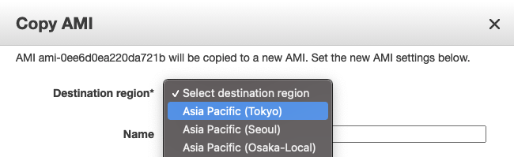

[AMI docs](https://docs.aws.amazon.com/AWSEC2/latest/UserGuide/AMIs.html)

## Instance IP Addressing

There are two types of IP addresses used by AWS, IPv4 and IPv6. We focus on IPv4. There are private IPv4 addresses which can communicate with your machine within the AWS infrastructure. There are public IP addresses which can communicate with your machine over the web.

Whenever you stop your machine AWS disassociates the public IPv4 address. When you start it again, you will receive a new address. You shouldn't rely on your instance having an unchanging public IPv4 address. If you really need a constant IPv4 address you can use an **elastic IP**, which associates a constant public IPv4 address with your instance. **Private IPv4 addresses are always constant.**

[Instance IP Addressing Docs](https://docs.aws.amazon.com/AWSEC2/latest/UserGuide/using-instance-addressing.html)

## User data scripts

When you launch an instance in Amazon EC2, you have the option of passing a **user data** script to the instance that will run when the machine starts. This way instead of making several AMIs that are similar, you can have a single AMI and use the user data script to customize it.

[EC2 Instance Metadata](https://docs.aws.amazon.com/AWSEC2/latest/UserGuide/ec2-instance-metadata.html)

You don't need to understand the script below, but in the docs they paste this to the console at instance creation to configure an instance as a web server.

    #!/bin/bash
    yum update -y
    amazon-linux-extras install -y lamp-mariadb10.2-php7.2 php7.2
    yum install -y httpd mariadb-server
    systemctl start httpd
    systemctl enable httpd
    usermod -a -G apache ec2-user
    chown -R ec2-user:apache /var/www
    chmod 2775 /var/www
    find /var/www -type d -exec chmod 2775 {} \;
    find /var/www -type f -exec chmod 0664 {} \;
    echo "<?php phpinfo(); ?>" > /var/www/html/phpinfo.php

[Run commands on your Linux instance at launch, AWS docs](https://docs.aws.amazon.com/AWSEC2/latest/UserGuide/user-data.html)

## Instance purchasing options

*   **On-Demand Instances**
    *   Pay for compute capacity by the second with no long-term commitments
    *   Use On-Demand Instances for applications with short-term, irregular workloads that cannot be interrupted.
    *   [On-Demand Instances docs](https://docs.aws.amazon.com/AWSEC2/latest/UserGuide/ec2-on-demand-instances.html)
*   **Reserved Instances**
    *   Pay up front for an EC2 instance, reserving it for a 1 to 3 year period.
    *   Do this for predictable workloads that will run for a long time.
    *   The longer you reserve the instance for and the more you pay up front (you can do a partial upfront) the larger the discount.
    *   There are different types of reserved instances.
        *   **Standard Reserved Instances** work as described above.
        *   **Convertible Reserved Instances** allow you to change instance type. You get a smaller discount for this.
        *   **Scheduled Reserved Instances** let you reserve within a part of the day. [This seems to be discontinued](https://docs.aws.amazon.com/AWSEC2/latest/UserGuide/ec2-scheduled-instances.html).
    *   [Reserved Instances docs](https://docs.aws.amazon.com/AWSEC2/latest/UserGuide/ec2-reserved-instances.html)
*   **Spot Instances** are unused EC2 instances that are available for less than the On-Demand price.
    *   The spot price is the hourly price set by Amazon EC2 based on the supply and demand for EC2 instances.
    *   You set a maximum price per hour you are willing to pay. When the spot price exceeds your maximum price then your EC2 instance is terminated.
    *   Well suited for things that don't need to run long, like data analysis or batch processing.
    *   [Spot Instances docs](https://docs.aws.amazon.com/AWSEC2/latest/UserGuide/using-spot-instances.html)
*   **Dedicated Hosts** are physical servers with EC2 instance capacity fully dedicated for your use. You do not share the physical hardware with anyone else.
    *   Some software licenses might need you to know information about your instances per-socket, per-core, or per-VM. Dedicated hosts provides visibility into these things for compliance with licenses.
    *   [Dedicated Hosts docs](https://docs.aws.amazon.com/AWSEC2/latest/UserGuide/dedicated-hosts-overview.html)
*   **Dedicated instances** are Amazon EC2 instances dedicate to a single customer. The instance may share hardware with other non-dedicated instances from the same account.
    *   [Dedicated Instances docs](https://docs.aws.amazon.com/AWSEC2/latest/UserGuide/dedicated-instance.html)

Dedicated Hosts and Dedicated Instances can both be used to launch Amazon EC2 instances onto physical servers that are dedicated for your use.

Here are some differences between the two:

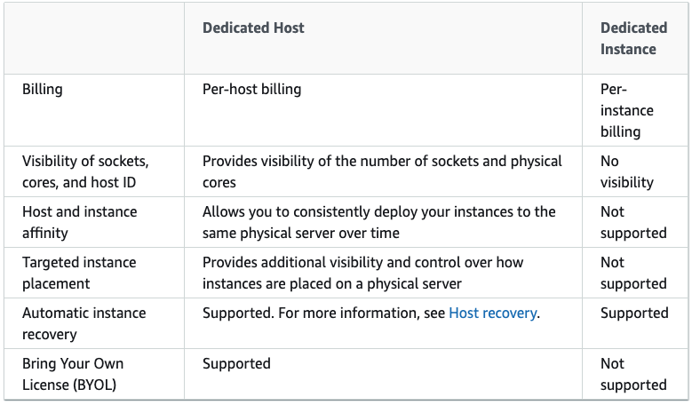

[Dedicated Hosts docs](https://docs.aws.amazon.com/AWSEC2/latest/UserGuide/dedicated-hosts-overview.html)

## More on Spot Instances

### Spot Fleet

A Spot Fleet is a collection, or fleet, of Spot Instances, and optionally On-Demand Instances. This fleet of instances tried to meet the capacity specified in the spot fleet request.

A Spot Instance pool is a set of unused EC2 instances with the same instance type (for example, m5.large), operating system, Availability Zone, and network platform.

The allocation strategy for the Spot Instances in your Spot Fleet determines how it fulfills your Spot Fleet request from the possible Spot Instance pools represented by its launch specifications. The following are the allocation strategies that you can specify in your Spot Fleet request:

*   `lowestPrice`
    *   The Spot Instances come from the pool with the lowest price. This is the default strategy.
*   `diversified`
    *   The Spot Instances are distributed across all pools.
*   `capacityOptimized`
    *   The Spot Instances come from the pool with optimal capacity for the number of instances that are launching.

[Spot Fleet docs](https://docs.aws.amazon.com/AWSEC2/latest/UserGuide/spot-fleet.html)

### Request Types

In the diagram below we see that a spot request launches instances. The spot request has a **request type** which determines if launched instances restart or not upon interruption (if the spot price goes above your max price or if you manually interrupt). Instances launched from a one-time spot request will go away, but instances launched from a persistent spot request will be restarted by the spot request. Thus, if you wish to terminate a persistent spot instance you must first terminate the request.

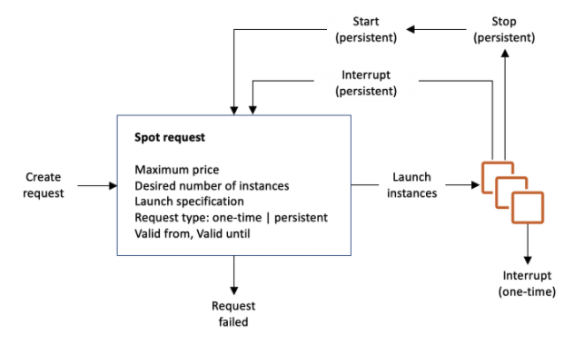

[Spot Instance request docs](https://docs.aws.amazon.com/AWSEC2/latest/UserGuide/spot-requests.html)

## EC2 Instance Types

Instances are classified as general purpose, compute optimized, memory optimized, and storage optimized.

*   **General purpose** instances are not specialized for particular use case. **M** type instances are good all-around. **T** type instances are burstable
*   **Compute optimized** instances are for high computational loads requiring more CPU. Consider using for scientific computing. **C** type instances.
*   **Memory optimized** have higher RAM for applications that need more memory like in-memory caches. **R** type instances.
*   **Storage optimized** instances are made for workloads with lots of sequential read/write access on data sets in local storage. Good for data warehousing applications like MapReduce and Hadoop. **D, H, and I** type instances.

[EC2 Instance Types docs](https://docs.aws.amazon.com/AWSEC2/latest/UserGuide/instance-types.html)

To determine if your instance is over-provisioned you can use the [AWS Compute Optimizer](https://docs.aws.amazon.com/AWSEC2/latest/UserGuide/ec2-instance-recommendations.html).

## Placement groups

EC2 tries to spread out your instances to minimize correlated failures. You can use placement groups to influence the placement of a group of interdependent instances to meet the needs of your workload. Types of placement groups are -

*   **Cluster** packs instances close together inside an Availability Zone. This strategy enables workloads to achieve the low-latency network performance necessary for tightly-coupled node-to-node communication that is typical of HPC applications.
*   **Partition** multiple groups of instances where each group belongs to the same rack in a data center, and different groups belong to different racks. This strategy is typically used by large distributed and replicated workloads, such as Hadoop, Cassandra, and Kafka.
*   **Spread** strictly places a small group of instances across distinct underlying hardware to reduce correlated failures.

### Rules and Limitations

### Cluster

Use this for low network latency and high network throughput. Correlated failures are a risk.

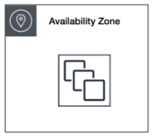

### Partition

Use this for distributed data processing. If a rack fails a group of instances may go offline.

You can only have 7 partitions per AZ, so if there are three AZ in a region we can have 21 partitions. Within each partition you can have as many instances as allowed by your account.

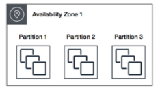

### Spread

Each instance is on its own rack. Each rack has its own power source and network.

You can only have 7 *instances* per AZ, so if there are six AZ in a region we can have 42 partitions. Within each partition you can have many instances.


[Placement Groups docs](https://docs.aws.amazon.com/AWSEC2/latest/UserGuide/placement-groups.html)

## Network Interfaces

An elastic network interface is a logical networking component in a VPC that represents a virtual network card. It can include the following attributes:

*   A primary private IPv4 address from the IPv4 address range of your VPC
*   One or more secondary private IPv4 addresses from the IPv4 address range of your VPC
*   One Elastic IP address (IPv4) per private IPv4 address
*   One public IPv4 address
*   One or more IPv6 addresses
*   A MAC address

You can create a network interface, attach it to an instance, detach it from an instance, and attach it to another instance. The attributes of a network interface follow it as it's attached or detached from an instance and reattached to another instance. When you move a network interface from one instance to another, network traffic is redirected to the new instance.

Each instance has a default network interface, called the primary network interface. You cannot detach a primary network interface from an instance.


<hr /> 

This is EC2 question 1

* [ ] Yes
* [ ] No

<details><summary><b>solution</b></summary>

* [X] Yes
* [ ] No

Yes

</details><hr /> 


<hr /> 

This is EC2 question 2

* [ ] Yes
* [ ] No

<details><summary><b>solution</b></summary>

* [X] Yes
* [ ] No

Yes

</details><hr /> 


<hr /> 

EC2 question

* [ ] Correct 1
* [ ] Correct 2
* [ ] You can output the JSX or YAML code for the problem to use in your program.
* [ ] Thanks!
* [ ] For multiple selection questions there are two correct answers usually.

<details><summary><b>solution</b></summary>

* [X] Correct 1
* [X] Correct 2
* [ ] You can output the JSX or YAML code for the problem to use in your program.
* [ ] Thanks!
* [ ] For multiple selection questions there are two correct answers usually.

This is where the solution is. Click to start editing.

</details><hr /> 


# Networking Basics

## IPv4

IP addresses specify the location of devices on the internet. IPv4 is a type of IP address. There are 32 bits in an IPv4 address, for a total of 2^32 (about 4 billion) IPv4 addresses. IPv4 is the most common way to do addressing, but only having 4 billion addresses has led to the creation of IPv6 (IPv6 isn't a major exam topic).

IP addresses are represented in "dot decimal" notation. There are four numbers 0-255 separated by decimals. So `120.247.236.38` is an IP address. IP addresses can be broken up into two parts, the **network prefix** which specifies the location of the network, and the **host identifier** which specifies a device on the network.

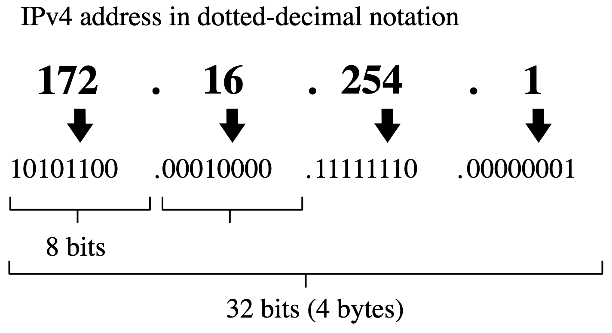

So maybe the network is specified by `120.247.236` and the host address is specified by `.38`. But how do we know where to split the address?

[IPv4 on Wikipedia](https://en.wikipedia.org/wiki/IPv4)

## CIDR

CIDR is a way of specifying ranges of IP addresses. In `120.247.236.0/24` the `/24` means that the first 24 bits (`120.247.236`) are the network identifier and that the network contains device ranging from `120.247.236.0` to `120.247.236.255`.

If we had something like `120.247.236.38/32` then every bit in the IP address is in the network prefix, and the network contains only a single device at `120.247.236.38/32`.

Here is a chart from the official specification:

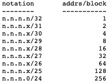

When we day 0.0.0.0/0 we are specifying all IPv4 addresses. This is can be used in AWS to say that any IP address can access a resource.

The term for the number that specifies the IP range in CIDR (i.e. `/24`, `/30`, etc.) is the **netmask**.

## Private Addresses

Some address ranges are private, meaning they are used for something like a private company wide 'intranet' but aren't sent over the public internet.

These IP addressses are reserved and are in the ranges

*   `10.0.0.0 – 10.255.255.255`, CIDR `10.0.0.0/8`
*   `172.16.0.0 – 172.31.255.255`, CIDR `172.16.0.0/12`
*   `192.168.0.0 – 192.168.255.255`, CIDR `	192.168.0.0/16`

Can you make sense of the relationship between the CIDR block and the IP range?

[CIDR on Wikipedia](https://en.wikipedia.org/wiki/Classless_Inter-Domain_Routing)

# VPC

## VPC Basics

Amazon Virtual Private Cloud (Amazon VPC) enables you to launch AWS resources into a virtual network that resembles a traditional network that you'd operate in your own data center, with the benefits of using the scalable infrastructure of AWS.

VPCs are specific to a region. A single VPC spans all the availability zones in a region. You can make subnets of a VPC, subnets are specific to availability zones.

<!-- TODO: subnets within -->

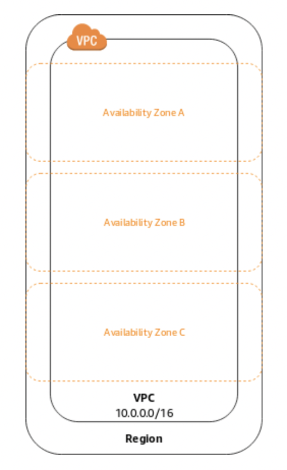

When you create a VPC, you must associate an IPv4 CIDR block for it. The CIDR block must contain between 16 and 65,536 IP addresses (netmasks of `/28` and `/16` respectively). If you see a question asking about CIDR block sizes know that it is between `/28` and `/16`.

Your CIDR block must be in the private IP ranges:

*   `10.0.0.0 – 10.255.255.255`, CIDR `10.0.0.0/8`
*   `172.16.0.0 – 172.31.255.255`, CIDR `172.16.0.0/12`
*   `192.168.0.0 – 192.168.255.255`, CIDR `  192.168.0.0/16 `

You can add multiple CIDR blocks to your VPC. CIDR blocks must not overlap, so we can't have both `10.0.0.0/28` and `10.0.0.1/28` in a VPC. You can never modify the range of an existing CIDR block

[How VPC works, AWS docs](https://docs.aws.amazon.com/vpc/latest/userguide/how-it-works.html)

## Subnet Sizing

When you divide an IP network into multiple parts, each part is called a subnet. The subnets will have CIDR blocks that are subsets of the CIDR block of the VPC.

The number of available IPv4 addresses in your subnet's CIDR block is not exactly what you think it would be.

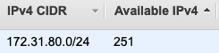

In a `/24` IPv4 we would expect for there to be 256 addresses, 2^(32-24) = 2^8 = 256. The reason there are only 251 available is that AWS reserves some of the IP addresses for it's own use.

The 5 missing IP addresses are reserved as follows:

*   `172.31.80.0` is used as the network address
*   `172.31.80.1` is reserved for the VPC router
*   `172.31.80.2` is reserved for the DNS
*   `172.31.80.3` is reserved by AWS for future use
*   `172.31.80.255` is the network broadcast address. AWS does not support broadcast so this is reserved.

If a question asks what IP addresses you can use, the first 4 IP addresses are reserved, as well as the last one. Be able to calculate the CIDR range for a simple example like 10.0.0.0/24.

[VPC subnets docs](https://docs.aws.amazon.com/vpc/latest/userguide/VPC_Subnets.html)

## Route Tables

Route tables specify how network traffic from subnets or the internet should be directed within the VPC.

Every subnet needs to be associated with a route table. This route table will direct traffic to the subnet.

### Example

Here is a route table for a VPC with CIDR block `172.31.0.0/16`.

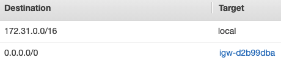

This route table is saying that traffic to the VPC (`172.31.0.0/16`) is local to the VPC and that traffic elsewhere (`0.0.0.0/0`) goes to `igw-d2b99dba` (this is an **internet gateway**, we discuss this later).

### Implied Routing

At the beginning of this section we said that every subnet needs to be associated with a route table, but our route table didn't say anything about any subnets. This is explained by the following image:

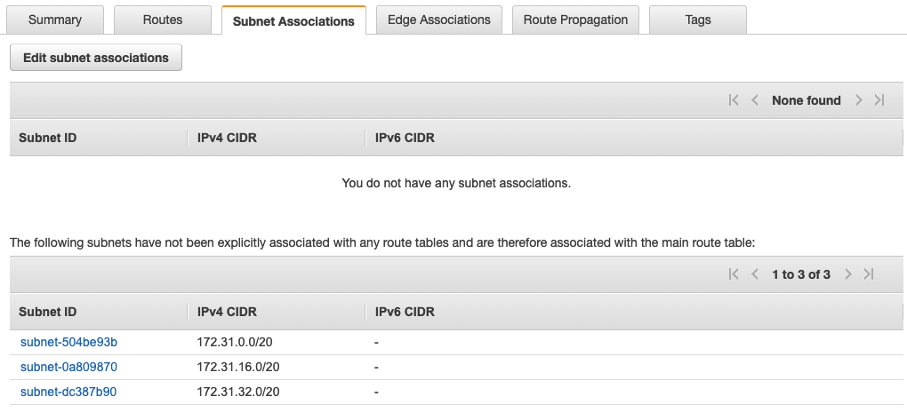

There is a **main route table** which is created when a new VPC is created. You do not need to explicitly associate a new subnet with a route table, there is an automatic association with the main route table.

You do not need to explicitly define routes for traffic *between subnets*. The VPC knows what ranges your subnets exist on and will take care of this for you.

### Main Route Table

Let's go over an example on the main route table from the AWS documentation.

Suppose you have two subnets and two route tables. Initially, both subnets have an implicit association with Route Table A, the main route table. We want to change both subnets to be associated with route table B.

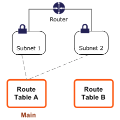

We can create an explicit association between subnet 2 and Route Table B.

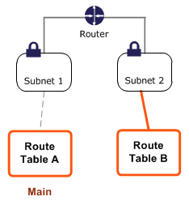

We can change the main route table from A to B, which will update the implicit association of subnet 1 from A to B.

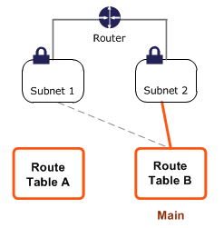

We can delete the explicit association between subnet 2 and table B, and it will still have an implicit association with the route table.

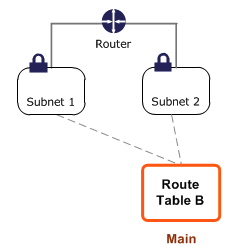

A route table can be associated with multiple subnets, but a subnet cannot be associated with multiple route tables.

[Route tables docs](https://docs.aws.amazon.com/vpc/latest/userguide/VPC_Route_Tables.html)

## Internet Gateway

Instances that have a public IP address in a subnet can connect to the internet we need an internet gateway. Let's look at a route table again to see how this works:


Traffic going to the private IPs of the CIDR block for the VPC stay `local` to the VPC. All other traffic goes to `igw-d2b99dba`, which is an internet gateway that will take this traffic to the internet. If this rule is not in the route table, then traffic will not get routed to the internet gateway even if there is a route table.

The internet gateway horizontally
s, is redundant, and is highly available. AWS manages these things. You do not need to worry about availability or scalability of your internet gateways.

[Internet Gateway docs](https://docs.aws.amazon.com/vpc/latest/userguide/VPC_Internet_Gateway.html)

## NAT devices

The internet gateway connects devices with public IPs to the internet. Some things shouldn't be accessible by the internet so they don't have a public IP. They still might need to access the internet to update or install new software though!

We solve this problem by using a NAT (Network Address Translation) device. The NAT device is in a public subnet and has a public IP that is used to communicate with the internet.

**The NAT device allows devices with private IPs to initiate outbound connections to the internet over IPv4 while preventing unwanted inbound connections**

NAT devices are either a **NAT instance** or a **NAT gateway**. The NAT instance has you do translation on an EC2 instance, the NAT gateway is managed by Amazon. NAT gateways are now the preferred NAT device (they are better and easier to use), but NAT instance questions can still appear on the exam.

### NAT instances

In the diagram below we see database servers that are in a private subnet and are connected to the internet using a NAT instance. The private subnet contains no routes pointing to the internet gateway, and the servers inside do not have public IPs.

Here is how it works:

1.  The Database servers send a request to a public IP.
2.  This public IP is in the range `0.0.0.0/0` and so it is routed to the NAT instance at `nat-instance-id`.
3.  The NAT instance sends this request to the public IP and receives a response back.
4.  The NAT instance sends the response back to the database servers on the private subnet at `10.0.1.0/24`.

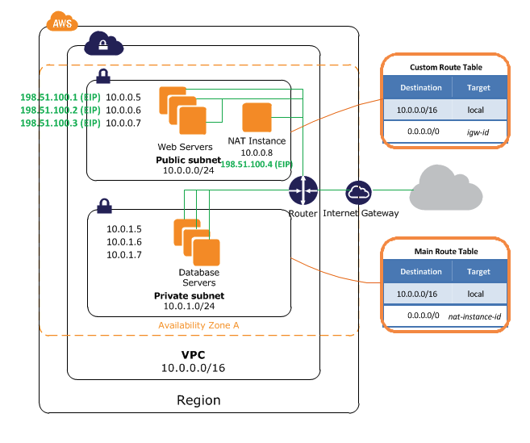

The NAT instance has an elastic IP (an IP address that doesn't change), this is required.

You must disable **source/destination checks** on your EC2 instance when using it as a NAT instance. These check if the instance is either the source or the destination of network traffic before accepting the traffic. The NAT instance is not the source/destination of the traffic, it is a middleman between the private subnet and the internet.

### NAT Gateway

The NAT Gateway does NAT but is managed by AWS so you don't have to worry about managing your own EC2 instance. NAT gateways will automatically scale up to 45 Gbps, but the NAT instance is dependent on the EC2 instance type.

Just like NAT instances, the NAT gateway has an elastic IP and lives in a public subnet.

The NAT gateway is redundant within each availability zone, but if the availability zone experiences problems then you will lose connectivity. You might be tempted to use a single NAT gateway in a single availability zone (NAT Gateways are specific to subnets which are specific to AZ), but then everything in your region loses connectivity if you lose a single AZ. This is why it is best to have separate NAT gateways for each AZ.

A comparison of the NAT gateways and instances from the AWS documentation:

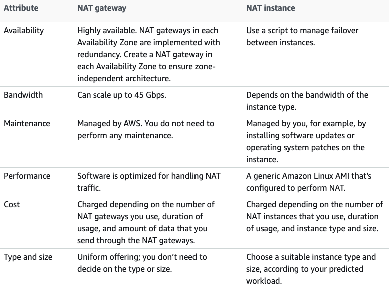

[NAT docs](https://docs.aws.amazon.com/vpc/latest/userguide/vpc-nat.html)

## Egress-only internet gateways

When we have a public IPv4 address or an IPv6 address and our EC2 instance is connected to a public gateway, we can send and receive traffic from the internet.

People on the internet can send us traffic even if we didn't ask for the traffic. This can be solved for IPv4 by having an instance in a private subnet that is attached to a NAT gateway.

For IPv6 traffic we can connect to an egress-only internet gateway (instead of a plain internet gateway). This will prevent unwanted traffic from reaching our instance. It will allow us to send requests to the internet and receive responses though.

[Egress-only internet gateway docs](https://docs.aws.amazon.com/vpc/latest/userguide/egress-only-internet-gateway.html)

## Security Groups

A security group is a virtual firewall. A firewall is a network device that decides what incoming and outgoing traffic to allow or to disallow. This firewall controls which CIDR blocks and security groups can communicate with an EC2 instances, as well as what ports this communication can happen on.

Multiple EC2 instances can have the same security group. The security group belongs to a VPC and all instances in that VPC can use the security group. All EC2 instances must have a security group.

Here are some properties of security groups:

*   You can specify allow rules but not deny rules, traffic that is not explicitly allowed is denied.
*   There are separate rules for inbound and outbound traffic.
*   Security groups are stateful. Suppose they sent a request to an IP address. They will be able to receive the response to their request even if they do not have an inbound security rule that would allow the traffic.

### Default Security Groups

*   When creating a new security group no inbound traffic is allowed by default. This is in contrast to the default security group that is created when a VPC is created, which does allow inbound traffic **only for traffic originating from the same security group**.
*   For both custom and default security groups, all outbound traffic is allowed by default.

[Security Groups docs](https://docs.aws.amazon.com/vpc/latest/userguide/VPC_SecurityGroups.html)

## Network ACL (Network Access Control List)

Network ACLs are also a type of firewall. Here are some differences between the network ACL and the security group.

*   Network ACLs are applied to subnets, security groups are applied to EC2 instances.
*   The network ACL is stateless, responses to inbound traffic are subject to the rules for outbound traffic. This is not true for security groups, where the outbound rules don't apply for responses to received inbound traffic (it is stateful).
*   The network ACL can have both allow and deny rules. The security group only has allow rules and everything not explicitly allowed is implicitly denied.

Here are some similarities between the network ACL and the security group.

*   They both control access within a VPC.
*   All subnets must be associated with a network ACL, just like all EC2 instances must have a security group.
*   You can associate a network ACL with multiple subnets, just like a security group can be associated with multiple EC2 instances.
*   VPCs come with a default network ACL, just like EC2 instances come with a default security group.

The default NACL that comes with the VPC allows all traffic in and out of the VPC. If you make a custom NACL, it will deny all inbound and allow all outbound traffic unless you make changes to these settings.

Since there are both allow and deny rules we need a way of deciding which rule is correct when the rules conflict. To solve this, there are numbers associated with each rule, and the lowest number wins. These numbers are from 1 to 32766. AWS recommends spacing out your rules, so that you can put a rule between your rules (ex. put rule 15 between rule 10 and rule 20) in case you need to.

[Network ACL docs](https://docs.aws.amazon.com/vpc/latest/userguide/vpc-network-acls.html)

## VPC Endpoints

VPC endpoints enable private connections between your VPC and AWS services.

Suppose we want to access an AWS service (like a database) from a private subnet. This service has a public IP that we can use. So we can use a NAT gateway to communicate from our private subnet to the internet which will communicate with the database.

It would be better if we could just talk to our AWS services over a private IP address and not send any traffic into the public internet. **This is the purpose of VPC endpoints.**

VPC endpoints are horizontally scaled, redundant, and highly available.

There are two types of VPC endpoints, the type you choose is determined by the service you are accessing:

*   Gateway endpoints are used for S3 and DynamoDB (two AWS services discussed in depth later).
*   Interface endpoints are used for other services.

[VPC endpoint docs](https://docs.aws.amazon.com/vpc/latest/userguide/vpc-endpoints.html)

## AWS PrivateLink (VPC endpoint services)

You can privately connect to AWS services using VPC endpoints. You can build your own **VPC endpoint services** on AWS and connect to them with a VPC endpoint just like you would connect to a prebuilt AWS service.

In the diagram below our VPC endpoint service is in VPC B. The dashed line around it is the service provider, `vpce-svc-1234`. The ENI of subnet A can access the network load balancer using an interface endpoint. If the network load balancer has instances spread across multiple availability zones then the solution will be fault-tolerant.

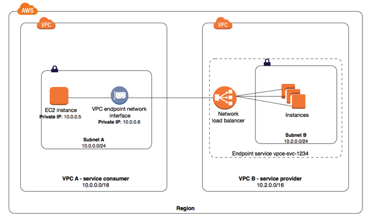

[VPC endpoint services docs](https://docs.aws.amazon.com/vpc/latest/userguide/endpoint-service.html)

## VPC Peering

VPC peering is a connection between two VPCs that allows you to route traffic between them privately. It allows you to communicate between different VPCs as if they were in the same VPC. You can create a VPC peering connection between your own VPCs, or with a VPC in another AWS account. The VPCs can be in different regions (also known as an inter-region VPC peering connection). The VPCs must have non-overlapping CIDR blocks.

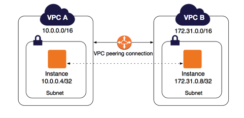

VPC peering is not transitive. In the image below, VPC A is connected to both VPC B and VPC C, but **VPC B is not connected to VPC C**.

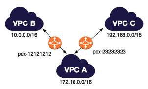

When peering VPCs you need to update your route tables to route traffic in the appropriate private IP range to the VPC peering connection.

[VPC Peering docs](https://docs.aws.amazon.com/vpc/latest/peering/what-is-vpc-peering.html)

## Bastion Hosts

You can set up a bastion host where you ssh into a public subnet. This bastion host in the public subnet will be able to ssh into private subnets.

[Bastion hosts blog post](https://aws.amazon.com/blogs/security/how-to-record-ssh-sessions-established-through-a-bastion-host/)

## What is a VPN?

https://docs.aws.amazon.com/whitepapers/latest/aws-vpc-connectivity-options/network-to-amazon-vpc-connectivity-options.html

Although the term VPN connection is a general term, in this documentation, a VPN connection refers to the connection between your VPC and your own on-premises network. Site-to-Site VPN supports Internet Protocol security (IPsec) VPN connections.

These options are useful for integrating AWS resources with your existing on-site services (for example, monitoring, authentication, security, data or other systems) by extending your internal networks into the AWS Cloud.

## Site to Site VPN Connection

You can configure a connection between a VPC and a local network, like your home network or the network for your office.

The diagram below shows the connection between an AWS VPC and an on-premises network. Let's talk about some of the components:

*   **VPN connection**: A secure connection between AWS and your on premises network.
*   **Virtual private gateway**: Sets up a secure connection on the AWS side.
*   **Customer gateway device**: A physical device that you set up on-premises to connect with AWS.
*   **Customer gateway**: A resource that you create in AWS that represents the customer gateway device in your on-premises network.

IPsec is just a protocol for

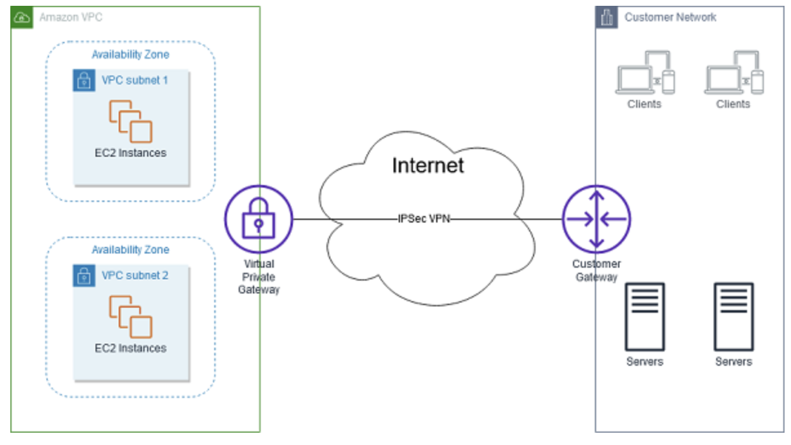

https://en.wikipedia.org/wiki/IPsec

[//]: # "https://docs.aws.amazon.com/vpn/latest/s2svpn/VPC_VPN.html"

[//]: # "https://docs.aws.amazon.com/vpn/latest/s2svpn/Examples.html"

[Site-to-Site VPN docs](https://docs.aws.amazon.com/vpn/latest/s2svpn/VPC_VPN.html)

## Transit Gateway

Transit gateway lets you connect VPN, direct connect, VPCs and more.

Suppose we want to connect many VPCs together. VPC peering is not transitive so it would take 45 connections to connect 10 VPCs together. With the transit gateway we connect all of the VPCs to the transit gateway and they can all talk to eachother. In the diagram below everyone can talk to eachother because the transit gateway allow transitive connection.

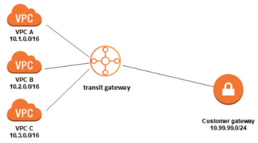

You can connect multiple user gateways to the transit gateway to implement redundancy and failover.

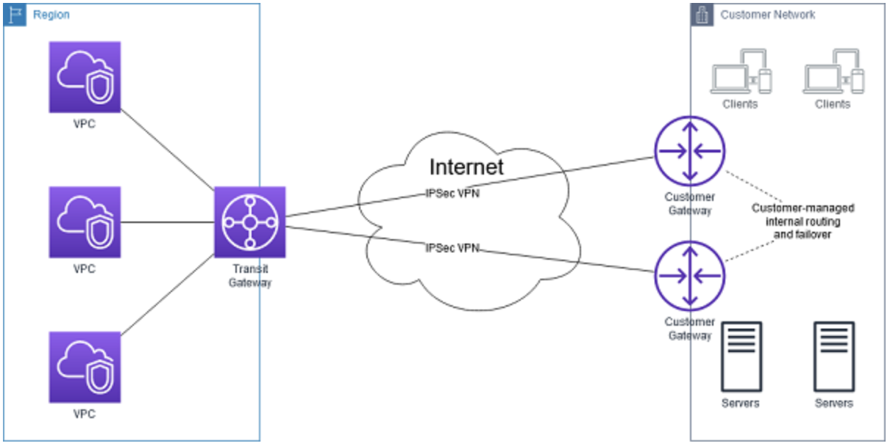

Transit gateways support IP multicast. This means that you can send multiple IP addresses at once to a transit gateway and it will communicate to them all. This is not supported in our other routing methods.

[Transit gateway docs](https://docs.aws.amazon.com/vpc/latest/tgw/what-is-transit-gateway.html)

## Direct Connect

AWS direct connect allows you to connect to AWS while bypassing your internet service provider. This is done to improve bandwidth and latency for things like working with large data sets or real-time data feeds.

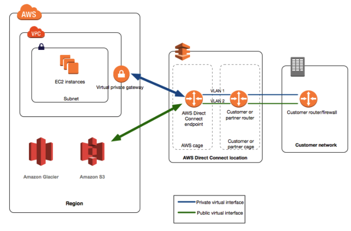

[Direct Connect docs](https://docs.aws.amazon.com/directconnect/latest/UserGuide/Welcome.html)

## VPN CloudHub

Cloudhub is specifically for the case when you need to connect multiple on-premise data centers to AWS, **but the transit gateway is more general**.

VPN cloudhub allows for multiple site-to-site connections and for communications between your sites. Sites must have non-overlapping IP ranges.

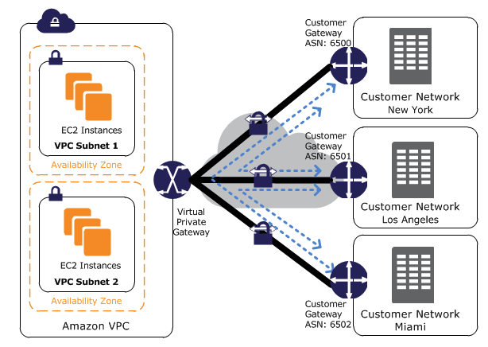

[VPN CloudHub docs](https://docs.aws.amazon.com/vpn/latest/s2svpn/VPN_CloudHub.html)

## VPC Flow Logs

VPC flow logs help you track information about IP traffic going in and out of the network interfaces (ENIs) of your VPC.

Flow logs can help you -

*   Troubleshoot issues with security group rules
*   Monitor traffic reaching an instance

You can create flow logs at varying levels of granularity: for a VPC, subnet, or a network interface. If you create a flow log for a subnet or VPC all the ENIs in the VPC/subnet will be monitored. You can write flow logs either to an S3 bucket (a storage service) or to Cloudwatch (a cloud monitoring service).

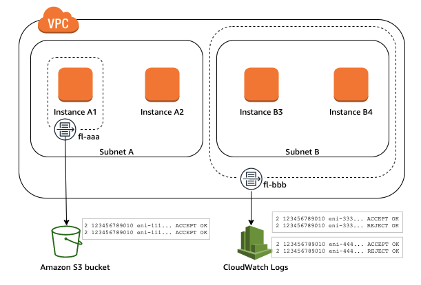

[Flow logs docs](https://docs.aws.amazon.com/vpc/latest/userguide/flow-logs.html)


<hr /> 

This is VPC question 1

* [ ] Yes
* [ ] No

<details><summary><b>solution</b></summary>

* [X] Yes
* [ ] No

Yes

</details><hr /> 


<hr /> 

This is VPC question 2

* [ ] Yes
* [ ] No

<details><summary><b>solution</b></summary>

* [X] Yes
* [ ] No

Yes

</details><hr /> 


# Auto Scaling

## What is Amazon EC2 Auto Scaling?

You create collections of EC2 instances, called Auto Scaling groups.

*   Specify the **minimum** number of instances in each Auto Scaling group, and Amazon EC2 Auto Scaling ensures that your group never goes below this size.
*   Specify the **maximum** number of instances in each Auto Scaling group, and Amazon EC2 Auto Scaling ensures that your group never goes above this size.
*   If you specify the **desired capacity**, either when you create the group or at any time thereafter, Amazon EC2 Auto Scaling ensures that your group has this many instances.

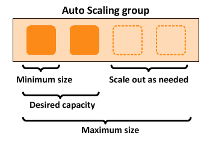

[What is auto-scaling docs](https://docs.aws.amazon.com/autoscaling/ec2/userguide/what-is-amazon-ec2-auto-scaling.html)

## Auto scaling benefits

*   Better fault tolerance.
    *   Amazon EC2 Auto Scaling can detect when an instance is unhealthy, terminate it, and launch an instance to replace it.
    *   You can configure Amazon EC2 Auto Scaling to use multiple Availability Zones. If one Availability Zone becomes unavailable, Amazon EC2 Auto Scaling can launch instances in another one to compensate.
*   Better availability by increasing compute to meet needs.
*   Cost savings by not buying too much, scale up to what you need.

## Dynamic Scaling Policy Types

Configure how your Auto Scaling group scales using dynamic scaling. There is an Amazon service called CloudWatch that can monitor things like CPU utilization of your EC2 instances. You can use a dynamic scaling policy to make sure that your Auto Scaling group meets a certain cloudwatch metric, like 50% CPU utilization.

There are three types of scaling policies:

*   **Target tracking scaling** - Increase or decrease the current capacity of the group based on a target value for a specific metric.
    *   Our example where we track 50% CPU Utilization is an example of target tracking scaling.
*   **Step/simple scaling** - Increase or decrease by a fixed amount when we hit a certain metric.
    *   Add 1 EC2 instance if capacity is under 40%. Remove 1 EC2 instance if capacity is over 60%.
*   **Based on SQS** - If you are processing messages from an SQS queue you can scale based on how many messages are in the queue.
    *   An SQS queue is a line of messages waiting to be processes by an EC2 instance.

[Scaling Policy Types](https://docs.aws.amazon.com/autoscaling/ec2/userguide/as-scale-based-on-demand.html#as-scaling-types)

## Scaling Cooldowns

A scaling cooldown helps you prevent your Auto Scaling group from launching or terminating additional instances before the effects of previous activities are visible.

When you use simple scaling, after the Auto Scaling group scales using a simple scaling policy, it waits for a cooldown period to complete before any further scaling activities initiated by simple scaling policies can start. An adequate cooldown period helps to prevent the initiation of an additional scaling activity based on stale metrics. By default, all simple scaling policies use the default cooldown period associated with your Auto Scaling group, but you can configure a different cooldown period for certain policies.

## Scheduled Scaling

Scheduled scaling helps you to set up your own scaling schedule according to predictable load changes. For example, let's say that every week the traffic to your web application starts to increase on Wednesday, remains high on Thursday, and starts to decrease on Friday. You can configure a schedule for Amazon EC2 Auto Scaling to increase capacity on Wednesday and decrease capacity on Friday.

To use scheduled scaling, you create **scheduled actions**. Scheduled actions are performed automatically as a function of date and time. When you create a scheduled action, you specify when the scaling activity should occur and the new desired, minimum, and maximum sizes for the scaling action. You can create scheduled actions that scale one time only or that scale on a recurring schedule.

## Lifecycle Hooks

You can run a lifecycle hook to respond to events in the lifecycle of EC2 instances in an auto-scaling group.

When scaling out you might want to run a script to download and install some software.

When terminating an instance you might want to perform some clean up actions.

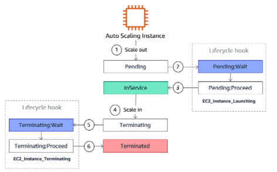

## Health Checks

The health status of an Auto Scaling instance is either healthy or unhealthy. All instances in your Auto Scaling group start in the healthy state. Instances are assumed to be healthy unless Amazon EC2 Auto Scaling receives notification that they are unhealthy. This notification can come from one or more of the following sources: Amazon EC2, Elastic Load Balancing (ELB), or a custom health check.

After Amazon EC2 Auto Scaling marks an instance as unhealthy, it is scheduled for replacement.

# Elastic Load Balancing

## What is Elastic Load Balancing?

Elastic Load Balancing automatically distributes your incoming traffic across multiple targets, such as EC2 instances, containers, and IP addresses, in one or more Availability Zones. It monitors the health of its registered targets, and routes traffic only to the healthy targets.

Using a load balancer increases the availability and fault tolerance of your applications.

Elastic Load Balancing supports the following load balancers: Application Load Balancers, Network Load Balancers, Gateway Load Balancers, and Classic Load Balancers.

*   Application Load Balancer
    *   Supports HTTP and HTTPS (Secure HTTP) protocols.
    *   Advanced routing.
*   Network Load Balancer
    *   Supports TCP, UDP, and TCP+UDP (Layer 4), and TLS listeners.
    *   It is architected to handle millions of requests/sec, sudden volatile traffic patterns and provides extremely low latencies.
*   Classic load balancer
    *   HTTP, HTTPS (Secure HTTP), SSL (Secure TCP) and TCP protocols.

## ALB

A load balancer serves as the single point of contact for clients. Clients send requests to the load balancer, and the load balancer sends them to targets, such as EC2 instances. To configure your load balancer, you create target groups, and then register targets with your target groups. You also create listeners to check for connection requests from clients, and listener rules to route requests from clients to the targets in one or more target groups.

HTTP requests and HTTP responses use header fields to send information about the HTTP messages. HTTP headers are added automatically. Header fields are colon-separated name-value pairs that are separated by a carriage return (CR) and a line feed (LF). A standard set of HTTP header fields is defined in RFC 2616, Message Headers. There are also non-standard HTTP headers available that are automatically added and widely used by the applications. Some of the non-standard HTTP headers have an X-Forwarded prefix. Application Load Balancers support the following X-Forwarded headers.

### Rule condition types

Rule condition types
The following are the supported condition types for a rule:

host-header
Route based on the host name of each request. For more information, see Host conditions.

http-header
Route based on the HTTP headers for each request. For more information, see HTTP header conditions.

http-request-method
Route based on the HTTP request method of each request. For more information, see HTTP request method conditions.

path-pattern
Route based on path patterns in the request URLs. For more information, see Path conditions.

query-string
Route based on key/value pairs or values in the query strings. For more information, see Query string conditions.

source-ip
Route based on the source IP address of each request. For more information, see Source IP address conditions.

The X-Forwarded-For request header is automatically added and helps you identify the IP address of a client when you use an HTTP or HTTPS load balancer. Because load balancers intercept traffic between clients and servers, your server access logs contain only the IP address of the load balancer.

### Lambda

You can register your Lambda functions as targets and configure a listener rule to forward requests to the target group for your Lambda function.

### Sticky

By default, an Application Load Balancer routes each request independently to a registered target based on the chosen load-balancing algorithm. However, you can use the sticky session feature (also known as session affinity) to enable the load balancer to bind a user's session to a specific target. This ensures that all requests from the user during the session are sent to the same target. This feature is useful for servers that maintain state information in order to provide a continuous experience to clients. To use sticky sessions, the client must support cookies.

### Misc

In order to make sure that ELB can scale to whatever volume you have and burst to whatever volume you suddenly encounter, AWS assigns a 'static' DNS hostname (e.g. MyDomainELB-918273645.us-east-1.elb.amazonaws.com). That hostname points to multiple IP addresses.

https://stackoverflow.com/questions/35313134/assigning-static-ip-address-to-aws-load-balancer

### Troubleshooting

If your target is not in the `InService` state it might be failing health checks, it won't be in service until it passes at least one health check. Make sure that your security group and NACL allow for access from the ALB.

There are different error codes you can get.

*   4xx errors are caused by the client.
    *   `HTTP 400: Bad request`
    *   `HTTP: 401: Unauthorized`
*   5xx errors means that there is a server-side error.
    *   `HTTP 500: Internal server error`
    *   `HTTP 503: Service unavailable` - this means your load balancer has no registered targets.

## NLB

*   Network Load Balancer
    *   Supports TCP, UDP, and TCP+UDP (Layer 4), and TLS listeners.
    *   It is architected to handle millions of requests/sec, sudden volatile traffic patterns and provides extremely low latencies.

## Cross-zone load balancing

If cross-zone load balancing is enabled, each of the 10 targets receives 10% of the traffic. This is because each load balancer node can route its 50% of the client traffic to all 10 targets.

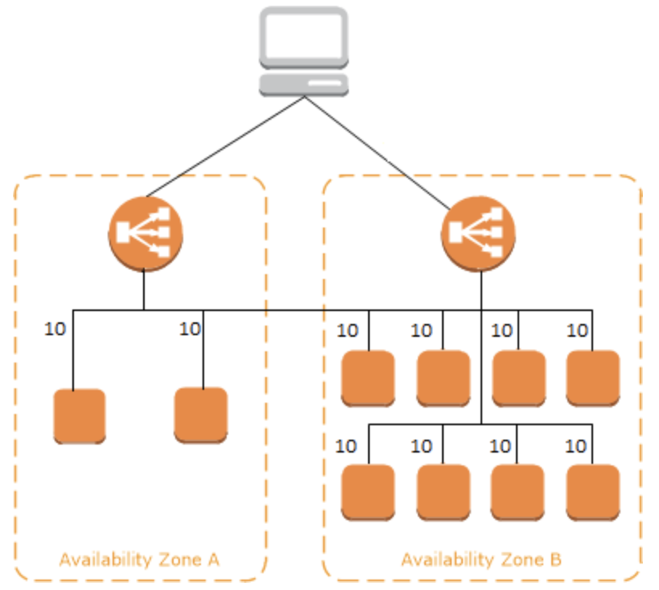

If not enabled then each AZ gets 50% of the traffic which doesn't evenly distribute across targets.

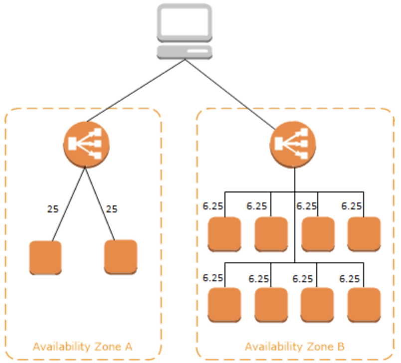

With Application Load Balancers, cross-zone load balancing is always enabled.

With Network Load Balancers and Gateway Load Balancers, cross-zone load balancing is disabled by default. After you create the load balancer, you can enable or disable cross-zone load balancing at any time.

When you create a Classic Load Balancer, the default for cross-zone load balancing depends on how you create the load balancer. With the API or CLI, cross-zone load balancing is disabled by default. With the AWS Management Console, the option to enable cross-zone load balancing is selected by default. After you create a Classic Load Balancer, you can enable or disable cross-zone load balancing at any time.

# EBS

## What is EBS?

EBS lets EC2 instances have persistent storage that doesn't go away when the instance stops, hibernates, or is terminated. EBS is like an external hard-drive for your EC2 instances. This is in contrast to EC2 **instance store volumes** which store temporary data on the same host computer.

The EBS volumes are not on the same host computer but instead are attached by the network. However, EBS volumes are specific to availability zone. The average latency between EC2 instances and EBS is single digit milliseconds.

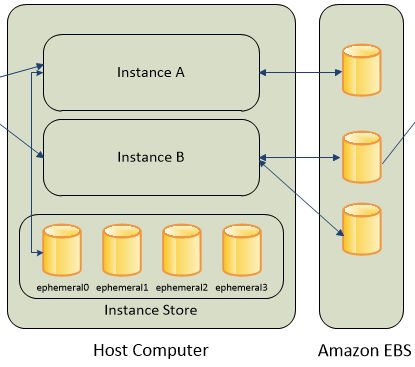

## Instance Types

The main instance types are:

*   Solid state drives (SSD) — Optimized for transactional workloads involving frequent read/write operations with small I/O size, where the dominant performance attribute is IOPS. The two types of SSD backed volumes are:
    *   **General Purpose SSD** (**gp2** and **gp3**): a balance of price and performance. We recommend these volumes for most workloads.
    *   **Provisioned IOPS SSD** (**io1** and **io2**) - Provides high performance for mission-critical, low-latency, or high-throughput workloads.
        *   Amazon EBS Multi-Attach enables you to attach a single Provisioned IOPS SSD (io1 or io2) volume to multiple instances that are in the same Availability Zone.
        *   Multi-attach only works for Nitro-enabled instances and io1 or io2. Nitro is providing some sort of hardware support. Up to 16 instances.
        *   EBS Block Express is the next generation of Amazon EBS storage server architecture. It has been built for the purpose of meeting the performance requirements of the most demanding I/O intensive applications that run on Nitro-based Amazon EC2 instances. io2 Block Express volumes are suited for workloads that benefit from a single volume that provides sub-millisecond latency, and supports higher IOPS, higher throughput, and larger capacity than io2 volumes.
*   Hard disk drives (HDD) — Optimized for large streaming workloads where the dominant performance attribute is throughput. The two types of HDD backed volumes are:

    *   **Throughput Optimized HDD (st1)** — A low-cost HDD designed for frequently accessed, throughput-intensive workloads.
    *   **Cold HDD (sc1)** — The lowest-cost HDD design for less frequently accessed workloads.

    <!-- TODO: Discuss IOPS in more precision -->

## Snapshots

You can create point-in-time snapshots of EBS volumes, which are persisted to Amazon S3. Snapshots protect data for long-term durability, and they can be used as the starting point for new EBS volumes. The same snapshot can be used to instantiate as many volumes as you wish.

## Encryption

You can expect the same IOPS performance on encrypted volumes as on unencrypted volumes, with a minimal effect on latency. You can access encrypted volumes the same way that you access unencrypted volumes. Encryption and decryption are handled transparently, and they require no additional action from you or your applications.

When you create an encrypted EBS volume and attach it to a supported instance type, the following types of data are encrypted:

*   Data at rest inside the volume
*   All data moving between the volume and the instance
*   All snapshots created from the volume
*   All volumes created from those snapshots

EBS encrypts your volume with a data key using the industry-standard AES-256 algorithm.

[EBS Volume Types docs](https://docs.aws.amazon.com/AWSEC2/latest/UserGuide/ebs-volume-types.html)

https://docs.aws.amazon.com/AWSEC2/latest/UserGuide/AmazonEBS.html

https://docs.aws.amazon.com/AWSEC2/latest/UserGuide/concepts.html

# S3

## Buckets

You can upload files (pictures, videos, data sets) to an Amazon S3 **bucket**. Generally you will access the buckets and their contents programatically, but you can also use the AWS console to work with the buckets. The buckets must have a name that follows certain conventions:

[Buckets Overview docs](https://docs.aws.amazon.com/AmazonS3/latest/userguide/UsingBucket.html)

*   Bucket names must be between 3 and 63 characters long.
*   Bucket names can consist only of lowercase letters, numbers, dots (.), and hyphens (-).
*   Bucket names must begin and end with a letter or number.
*   Bucket names must not be formatted as an IP address (for example, 192.168.5.4).
*   Bucket names must be unique within a partition. A partition is a grouping of Regions. AWS currently has three partitions: aws (Standard Regions), aws-cn (China Regions), and aws-us-gov (AWS GovCloud \[US] Regions).

[Bucket Naming docs](https://docs.aws.amazon.com/AmazonS3/latest/userguide/bucketnamingrules.html)

## Objects

The files you store in S3 are called \***objects**. Each object has a **key** which is a unique identifier within the bucket, and associated with this key is the **value** which is the stored file.

Objects can be up to 5TB in size but you can only upload 5GB at a time so you will need to use a multi-part upload for files larger than 5GB.

[Using Objects ](https://docs.aws.amazon.com/AmazonS3/latest/userguide/UsingObjects.html)

Folders can be represented within S3 -

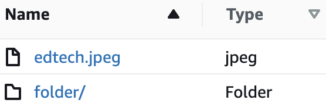

S3 only supports buckets and objects (the files are a lie!) and this filesystem interface is a convenience provided to users of the console.

The object key refers to the entire "path" to the object.
So the object key might be "folder/fileInFolder.png".

[Object Keys docs](https://docs.aws.amazon.com/AmazonS3/latest/userguide/object-keys.html)

## Data Consistency

In December 2020 AWS delivered strong read-after-write consistency for PUTs and DELETEs on objects. This means that if you upload a new object then you can immediately read it from the bucket.

This is how you want things to behave but before this S3 had eventual consistency, which meant you often had to wait a moment to guarantee you had fresh data.

If you have concurrent requests things can get tricky. Like if you are uploading a new version at the same time as you are requesting the object, you might get either the old or the new version.

Bucket configurations are eventually consistent, so if you enable versioning you might want to wait 15 minutes before starting to upload things.

[Welcome to S3 docs](https://docs.aws.amazon.com/AmazonS3/latest/userguide/Welcome.html)

## Encryption

You can do encryption server-side or client-side, and within server-side you have several options.

*   Server-Side
    *   SSE-S3: Server-Side Encryption with Amazon S3-Managed Keys
    *   SSE-KMS: Server-Side Encryption with Customer Master Keys (CMKs) Stored in AWS Key Management Service
    *   SSE-C: Server-Side Encryption with Customer-Provided Keys
*   Client-Side

[Encryption docs](https://docs.aws.amazon.com/AmazonS3/latest/userguide/UsingEncryption.html)

### SSE-S3

S3 encrypts each object with a key, which is also encrypted by a master key, and the master key is regularly rotated. Uses AES-256 encryption.

When using the REST API for S3 set the `x-amz-server-side-encryption` request header to `AES-256` to let AWS know that they need to server-side encrypt the object before uploading it to S3.

[SSE docs](https://docs.aws.amazon.com/AmazonS3/latest/userguide/UsingServerSideEncryption.html)

### SSE-KMS

When using the REST API set the `x-amz-server-side-encryption` request header to `aws:kms`.

AWS KMS is the AWS Key Management Service and it manages keys for encryption. Using this service to encrypt S3 data via SSE-KMS will provide a better audit trail than using SSE-S3.

[KMS docs](https://docs.aws.amazon.com/AmazonS3/latest/userguide/UsingKMSEncryption.html)

### SSE-C

You must provide the encryption key to AWS when you upload the object. If you want to read the encrypted object, you must provide the same key! If you forget which key goes to which object or lose the key, the object is lost forever.

You must use HTTPS because you are sending sensitive information (the key) over the internet.

[Customer keys docs](https://docs.aws.amazon.com/AmazonS3/latest/userguide/ServerSideEncryptionCustomerKeys.html)

### Client-Side Encryption

You write an encrypted object to S3 and store it there. You can retrieve this encrypted object and decrypt it yourself.

[Client-side encryption docs](https://docs.aws.amazon.com/AmazonS3/latest/userguide/UsingClientSideEncryption.html)

## Managing Access

By default only the person creating an S3 bucket has access to it. To allow other users access we can either make the bucket more permissive or give the other user elevated permissions.

The bucket controls who accesses it via **Bucket ACLs** and **Bucket Policys**. Objects within the bucket can have an **Object ACL** that specifies who can access.

Users are granted privileges through AWS IAM.

[S3 Access Control](https://docs.aws.amazon.com/AmazonS3/latest/userguide/access-control-overview.html)

## CORS

Suppose we have a website https://example1.com, and someone else has an api at https://example2.com/api. The owner of example2.com might not want you using their api. By default the browser will prevent this unless the owner of example2.com explicitly allows it using CORS (Cross Origin Resource Sharing).

The implementation is that the browser will send a preflight request asking example2.com/api if example1.com can access it.

If you get an error like `No 'Access-Control-Allow-Origin' header is present on the requested resource.` then you have a CORS error.

[An article on CORS]: # "https://medium.com/@buddhiv/what-is-cors-or-cross-origin-resource-sharing-eccbfacaaa30"

## Versioning

Versioning helps you prevent accidentally overwriting or deleting a file. In a versioning enabled bucket if the same object key is written multiple times, all of the writes will be recorded with the same object key but having different version IDs.

If you delete an object in a versioned S3 bucket all of the values associated with that key will remain, but a delete marker will be placed to indicate that the object has been deleted. To restore the data you can simply delete the delete marker. If you want to actually delete something from a versioned bucket you will have to specify which version you want to delete.

If you enable versioning on a previously unversioned bucket then all existing objects will be given a version ID of null. Once you enable versioning on a bucket it can no longer go back to the unversioned state, but you can suspend versioning. Suspended versioning buckets retain all existing versions but otherwise behave like an unversioned bucket.

[Versioning docs](https://docs.aws.amazon.com/AmazonS3/latest/userguide/Versioning.html)

### MFA Delete

You can enable **MFA delete** to add another layer of security.

MFA delete requires additional authentication for either of the following operations:

*   Changing the versioning state of your bucket
*   Permanently deleting an object version

MFA delete requires two forms of authentication together:

*   Your security credentials
*   The concatenation of a valid serial number, a space, and the six-digit code displayed on an approved authentication device

This means that if your account is compromised that the attacker will not be able to delete any object versions.

The bucket owner, which is the AWS account that created the bucket (root account), and all authorized IAM users can enable versioning. However, only the bucket owner (root account, not IAM user) can enable MFA delete.

You cannot enable MFA Delete using the AWS Management Console, you must use the CLI.

## Storage Classes

*   **S3 Standard**
    *   Designed for frequently accessed data.
    *   Replicated across multiple availability zones for increased availability.
    *   No retrieval fees.
*   **S3 Standard-IA**
    *   Long-lived infrequent accessed data.
    *   Per-GB retrieval fees, which is why you use this for infrequently accessed data.
*   **S3 One Zone-IA**
    *   Long-lived, infrequently accessed, non-critical data.
    *   Only stored in one AZ, not resilient to loss of AZ.
    *   Less expensive than Standard-IA.
    *   Yes retrieval fees.

The S3 Standard-IA and S3 One Zone-IA storage classes are suitable for objects larger than 128 KB that you plan to store for at least 30 days. If an object is less than 128 KB, Amazon S3 charges you for 128 KB. If you delete an object before the end of the 30-day minimum storage duration period, you are charged for 30 days.

*   **S3 Intelligent-Tiering**
    *   Use for long-lived data with changing or unknown access patterns.
    *   Automatically puts the object in an optimal storage class based on historical access patterns.
    *   Monitoring and automation fees apply per object.
    *   No retrieval fees.
*   **S3 Glacier**
    *   Use for archives where portions of the data might need to be retrieved in minutes. Data stored in the S3 Glacier storage class has a minimum storage duration period of 90 days and can be accessed in as little as 1-5 minutes using expedited retrieval. If you have deleted, overwritten, or transitioned to a different storage class an object before the 90-day minimum, you are charged for 90 days.
    *   Per GB retrieval fees apply. You must first restore archived objects before you can access them.
*   **S3 Glacier Deep Archive**
    *   Use for archiving data that rarely needs to be accessed. Data stored in the S3 Glacier Deep Archive storage class has a minimum storage duration period of 180 days and a default retrieval time of 12 hours. If you have deleted, overwritten, or transitioned to a different storage class an object before the 180-day minimum, you are charged for 180 days.
    *   The lowest cost storage option in AWS.
    *   Per GB retrieval fees apply. You must first restore archived objects before you can access them.

## Lifecycle Transitions

There are two types of lifecycle transitions.

*   **Transition actions**: Define when objects transition to a different storage class.
*   **Expiration actions**: Define when objects expire. Amazon S3 deletes expired objects on your behalf.

Amazon S3 supports a waterfall model for transitioning between storage classes, as shown in the following diagram. So you can't transition from a lower step to a higher step.

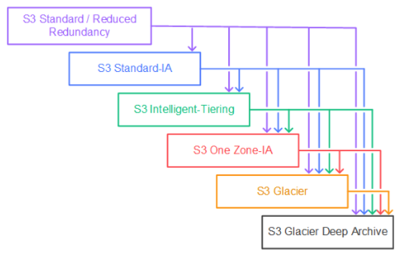

Before you transition objects from the S3 Standard or S3 Standard-IA storage classes to S3 Standard-IA or S3 One Zone-IA, you must store them at least 30 days in the S3 Standard storage class.

## Optimizing Performance

### Prefixes

Amazon S3 automatically scales to high request rates. For example, your application can achieve at least 3,500 PUT/COPY/POST/DELETE or 5,500 GET/HEAD requests per second per prefix in a bucket. Valid prefixes for a bucket `mybucket` include `mybucket/folder1`, `mybucket/folder2`, `mybucket/folder1/subfolder`. There are no limits to the number of prefixes in a bucket.

You can increase your read or write performance by parallelizing reads. For example, if you create 10 prefixes in an Amazon S3 bucket to parallelize reads, you could scale your read performance to 55,000 read requests per second. Similarly, you can scale write operations by writing to multiple prefixes.

### Transfer Acceleration

S3 Transfer Acceleration lets users upload to an edge location in AWS Cloudfront which then sends the data to AWS over an optimized path.

Transfer acceleration will not happen if Amazon does not think it will cause meaningful improvements.

# Databases

## What is a database?

Let's talk about the basic types of databases before we talk about AWS services. Databases help you store and interact with data.

Let's review some different types of databases.

### What is a relational database?

Skip this section unless you need a review of relational databases.

Consider an application like Instagram. There are users. Users can take photos. People can like the photos. How should we represent this? The relational database solution is to have separate tables that represent the users, photos, and likes.

The user table contains our users. If we have two users, one cat and one dog, the user table might look like this:

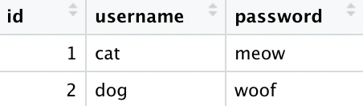

Suppose we have one photo, a selfie uploaded by the cat. Notice that we use the `id` from the user table to indicate the owner of the photo. This is why it is a **relational** database.

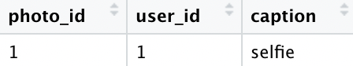

The user with id 2 likes the photo with id 1, the dog liked the cat's selfie.

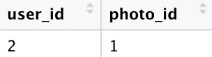

Here is a rough diagram of the way things work. ER diagrams are outside the scope of discussion so some conventions are not followed.

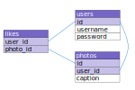

### What is a NoSQL database?

NoSQL databases don't have the rectangular tables and relationships between tables the way relational databases do. Instead of relationships we store data in the way that it is queried. When we view a user's profile we need their photos, so maybe photos should be included with the username.

```json
[
  {
    "id": 1,
    "username": "cat",
    "password": "meow",
    "photos": [
      {
        "id": 1,
        "caption": "selfie",
      }
    ]
  },
  {
    "id": 2,
    "username": "dog",
    "password": "woof",
    "likes": [
      1
    ]
  },
]
```

Since the dog had no photos there is no attribute for photos. Different items have different fields. We say that it is **schemaless**.

**NoSQL drawbacks:** We have all the data as the relational database previously discussed. A pain point of NoSQL databases is the lack of flexibility in querying. Consider that we can easily access all the likes of the dog, but that our photo doesn't know who liked it. We could solve this by including likes on the photo, but what if a user has 1000 photos that each get 1,000,000 likes? Should we really store all that information in one place? NoSQL requires a different way of thinking. You need to know how you are going to use your data before setting up the tables. With relational databases SQL gives us a lot of flexibility in how we write our queries.

**NoSQL advantages:** NoSQL databases are built for scalability and performance. With relational databases you typically scale vertically by using a bigger machine to host your database. With NoSQL you scale horizontally, adding servers as you need.

### Online transaction processing vs. Online analytical processing

OLTP is used to manage transactional workloads, like inserting a new user when a user signs up to a website. OLAP is used to run complex queries for things like business intelligence.

Relational databases can be row oriented or column oriented.

Row oriented databases store entries of a row in adjacent memory locations. This makes it easy to insert/delete rows for transactional (OLTP) workloads.

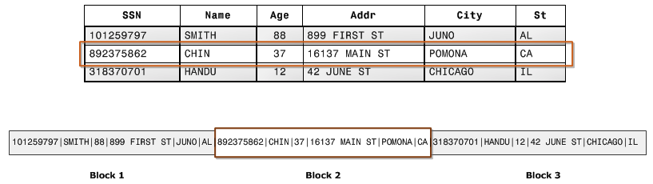

Column oriented databases store entries of a column in adjacent memory locations. Analytical workloads (OLAP) often involve operations on a column like summing it or grouping it, so this architecture is optimized for analytical workloads.

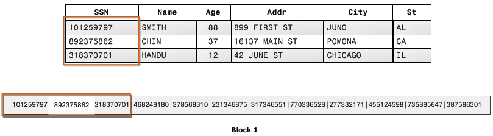

Amazon Redshift is column oriented, databases on RDS are row oriented. You can learn more about Redshift architecture [here](https://docs.aws.amazon.com/redshift/latest/dg/c_columnar_storage_disk_mem_mgmnt.html)

### What is an in-memory database

Computers have memory (RAM) and storage. Storage is either Solid-state drive (SSD) or hard disk drive (HDD).

Memory is everything your computer is currently thinking about. Storage is everything your computer knows.

It is fast to access something from memory, it is slow to access something from storage. This is why more RAM speeds up computers, they access storage less often.

Relational databases store all of their data in storage, what if we had a database that stored everything in memory? We would have faster access times. This is why we use in-memory databases (IMDB).

## Amazon Relational Database Service (RDS)

Amazon RDS manages a server with a relational database installation and automates common tasks like performing backups or patching software. AWS doesn't even give you access to the shell for the machine RDS is running on, you won't need it.

RDS supports the following databases:

*   MySQL
*   MariaDB
*   Oracle
*   SQL Server
*   PostgreSQL

Let's talk features.

### Scalability

*   Scale storage on the fly with no downtime.
*   **Read replicas** - a read-only replica of your database. Serve high-volume read traffic from the read-replica and the primary database for increased overall read capacity.

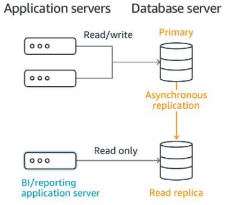

### Availability and durability

*   Backups allow you to restore your database from a previous state. There are two types.
    *   Automated backups: Allows you to recover to a point in time from the retention period The retention period can be configured to be up to 35 days.
    *   Database snapshots: User initiated snapshots that are stored in S3 and must be manually deleted.
*   You can deploy to multiple availability zones (AZs). This makes a primary instance in one AZ which replicates data to an instance in another AZ. If the infrastructure in your primary AZ fails, RDS will automatically transfer to the replica with minimal downtime.

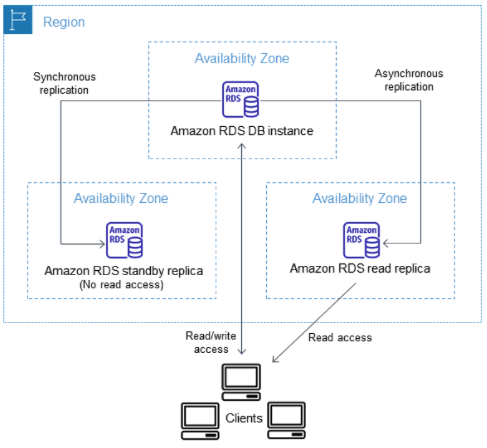

### Security

**At rest and in transit**: You are able to encrypt data at rest with keys managed in AWS Key Management Service (KMS). On a database running with encryption, data in the underlying storage is encrypted, as well as the data in automated backups, read replicas, and snapshots. Data in transit is secured using SSL.

**Network isolation**: Run your database in a VPC. Use network access control lists (NACLs) and security groups to control traffic to the RDS instance.

### Manageability

AWS provides Amazon CloudWatch metics for your database instances at no extra charge.

[RDS features overview](https://aws.amazon.com/rds/features/)

## Aurora

Amazon Aurora is a relational database engine that is compatible with MySQL and PostgreSQL. Aurora isn't competing with RDS, Aurora is an instance type on RDS just like PostgreSQL. There are some special features of Aurora that improve upon the other RDS instance types.

### Performance

Aurora offers five times the performance of MySQL and three times the performance of PostgreSQL.

### Hardware and Scaling

**You can scale storage**: You do not provision storage for Aurora. Aurora will automatically scale storage up to 128TB with a minimum storage of 10GB depending on your use. Scaling does not impact performance.

**You can scale compute**: Compute depends on your instance type. You can change the instance type of an existing DB but this will impact availability during the maintenance period.

### Backup and Restore

As with all RDS instances, we can take snapshots to backup the database. For Aurora specifically, automated backups are always enabled.

### High Availability and Replication

Aurora is fault tolerant. Your database is replicated 6 ways across 3 availability zones. Aurora is also self healing, like wolverine.

You can make Aurora replicas for read-scaling or high availability. You can also make MySQL replicas if you are using Aurora MySQL. The main benefit of MySQL replicas is that they can be cross-region, and Aurora replicas are confined to the region of the instance. I am not sure the use case for MySQL replicas because for cross region replication I would use Aurora Global Database.

Aurora Global Database allows for you to physically replicate your database across regions. It is recommended for low-latency global reads and disaster recovery.

### Security

You can encrypt data at rest and in transit as you would in other RDS instance types.

### Aurora Serverless

There is a serverless offering that autoscales to your required capacity. Ideal for unknown or variable workloads.

https://aws.amazon.com/rds/aurora/faqs/

## Amazon DynamoDB

Amazon DynamoDB is a serverless NoSQL database. With RDS you have to choose what kind of EC2 instance Amazon will manage your database on. With DynamoDB we don't worry about that. We can scale up and down as much as we like without worrying about the size of an EC2 instance.

We don't have to worry about availability or fault tolerance, they are built right in.

### Performance

DynamoDB Accelerator (DAX) is an in-memory cache that improves read performance up to 10x, bringing read times from single digit millisecond to microseconds.

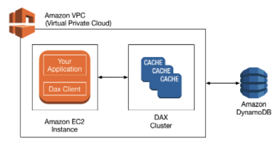

DynamoDB global tables replicate tables across regions to scale capacity and allow local access in selected regions for improved performance.

### Serverless

*   DynamoDB has two modes, on-demand and provisioned.
    *   Use on-demand if you don't know how much peak capacity you need.
    *   Provisioned will automatically scale, but up to a certain maximum capacity (unlike on-demand). Provisioned capacity is more cost effective when you are able to predict the max capacity.
*   When data is modified in DynamoDB you can capture it in a DynamoDB **stream**. This will capture writes/updates/deletes from a DynamoDB table. You can use the stream with AWS Lambda to perform actions in response to changes made to the table.

### Enterprise Ready

*   Supports transactions. These are multiple batched operations that either all succeed or all fail. Useful when a single operation needs to make multiple operations.
*   Data is encrypted by default with AWS Key Management Service (KMS).
*   Point-in-time recovery allows you to continuously back up your data for a specified retention period.
*   On-demand backup and restore lets you manually create a full backup of your tables.

[DynamoDB features overview]()

## Amazon Redshift

Redshift is a column oriented database used for OLAP.

You load data into Redshift tables, and then you do parallel processing on the loaded data to perform the analytics.

The leader node sends instructions to the compute nodes which perform the instructions in parallel on data from the client applications.

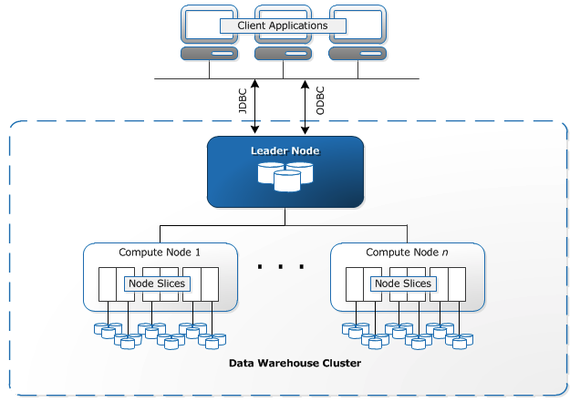

You can query live databases using federated queries. You can query from S3 without loading into Redshift tables using Amazon Redshift Spectrum.

You pay per hour with the payment rate determined by the size of your compute node.

## Elasticache

Amazon Elasticache makes it easy to host an in-memory database (IMDB) in the cloud. It supports two types of databases, Redis and Memcached. Redis is more popular and more flexible than Memcached.

Elasticache gives you sub-millisecond performance. Use Elasticache if you need low latency.

You can cache results from a database to improve latency and performance, or you can just use it as a fast key-value store for things like user-authentication tokens.

Elaticache stores simple data, not complex related tables.

To set up Elasticache you tell AWS what size instance you need. They provision the resources and manage the installation for you (installing patches, server maintenance, etc).

Elasticache resources belong to a VPC so you can use security groups and network ACLs to control access to your instance.

Elasticache is integrated with CloudWatch for monitoring.

## Other Databases

I'm not so sure about what kind of questions you might see.

*   AWS Database Migration Service is for migrating databases.
*   Amazon Neptune is a graph database for highly relational data
*   Amazon Elasticsearch Service allows you to perform a fuzzy search on JSON data.

# Amazon Simple Notification Service (SNS)

## What is SNS?

Amazon SNS delivers messages from publishers to subscribers, this pattern is often called pub-sub.
You can publish a message to an SNS topic and all of the subscribers to this topic will receive the message.

Subscribers to the topic can be SQS queues, HTTP, email, mobile push notifications, and mobile text messages (SMS). The publishers are AWS services, an example use case is using SNS to send yourself a text message when you set off an Amazon CloudWatch alarm.

## Fanout pattern

A common use case is sending messages to many different subscribers. Having an SNS topic means our publisher only has to send data to one place, the SNS topic is used to "fanout" the message.

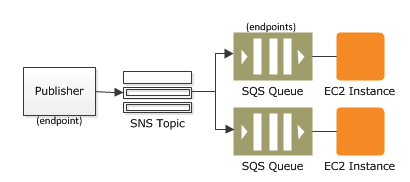

You can use the fanout pattern to replicate data sent to your production environment with your test environment, this way you can test your application with data received from your production application.

[Common SNS Scenarios - docs](https://docs.aws.amazon.com/sns/latest/dg/sns-common-scenarios.html)

## FIFO

Just like there are SQS standard and SQS FIFO, there are SNS standard and SNS FIFO. The differences are quite similar.

*   Standard is best-effort message ordering, FIFO is always in the same order the message was sent.
*   Standard is at-least once message delivery, FIFO is exactly-once message delivery.
*   Standard has higher throughput than FIFO.
*   Only FIFO SQS queues can subscribe to FIFO SNS topics. Lambda, HTTP, SMS, email, and mobile apps can all subscribe to standard SNS topics but not FIFO SNS topics.

Use FIFO SNS topics with FIFO SQS queues when you need to decouple an application and the order of messages is important.

## Message Filtering

By default, an Amazon SNS topic subscriber receives every message published to the topic. To receive a subset of the messages, a subscriber must assign a filter policy to the topic subscription.

Messages sent from an SNS topic can include a `MessageAttributes` field that can be filtered on by subscribers.

```json
{
   "Type": "Notification",
   "MessageId": "a1b2c34d-567e-8f90-g1h2-i345j67klmn8",
    ...,
   "MessageAttributes": {
      "customer_sport": {
         "Type": "String",
         "Value": "soccer"
      },
      "store": {
         "Type": "String",
         "Value":"example_corp"
      },
      "event": {
         "Type": "String",
         "Value": "order_placed"
      },
      "price_usd": {
         "Type": "Number", 
         "Value":210.75
      }
   }
}
```

In the subscription filter we can define a JSON policy that determines which messages we accept. Here is a policy that accepts.

```json
{
   "store": ["example_corp"],
   "event": [{"anything-but": "order_cancelled"}],
   "customer_interests": "soccer",
   "price_usd": [{"numeric": [">=", 100]}]
}
```

This should be detailed enough for the exam, but you can learn more in [the documentation](https://docs.aws.amazon.com/sns/latest/dg/sns-message-filtering.html).

# Amazon Simple Queue Service (SQS)

## What is SQS?

Amazon Simple Queue Service helps you decouple message producers and message consumers.

Suppose you have an online voting application that will have millions of people voting at once. It would be hard to handle millions of messages per second, but with SQS you can have a queue that stores all the votes and then you process them as they come.

A queue is just a fancy word for a line, you take all the votes and you make them sit in a line until you are ready to process them, just like lines work at the grocery store.

[What are possible use cases for Amazon SQS - StackOverflow
](https://stackoverflow.com/questions/31752503/what-are-the-possible-use-cases-for-amazon-sqs-or-any-queue-service)

## Standard vs. FIFO

There are standard and there are FIFO queues.

*   Standard queues
    *   Nearly unlimited number of transactions per second.
    *   Messages are delivered at least once, but sometimes more than once.
    *   Best effort ordering. Occasionally, messages will be delivered out of the order they were sent in.
    *   Useful for very high throughput.
*   FIFO queues
    *   Up to 3000 messages per second, standard is nearly unlimited.
    *   First-in-first-out means the first message in the first message out of the queue, compare this to standard queues which are best effort ordering.
    *   No duplicates, messages delivered exactly once.

## Configuration

*   **Message Visibility Timeout**: The queue holds messages but the consumer must ask for the message, it doesn't "push" messages. Once a consumer asks for a message, the message disappears so that no other consumers ask for the same message while it is being processed.
    *   The default visibility is 30 seconds, so once the message is consumed you have 30 seconds to process **and delete** the message before it will be returned to the queue.
    *   If you do not delete the message before the timeout is up it will be returned to the queue.
*   **Message Retention Period**: You need to delete your message from the queue once you process it otherwise it stays in the queue, but for how long? It stays until the message retention period is over.
    *   The default message retention period is 4 days, so after 4 days a message will automatically be deleted from the queue.
*   **Delivery Delay**: When you send a message to the queue the consumers can't access it until the delivery delay is over. By default the delay is 0 seconds.

## Access Policy

<!-- TODO: Expand this -->

You can manage access with IAM, but just like S3 buckets have their own access policies, SQS queues have their own access policies written in JSON. Here is the default policy saying that only the owner of the queue can send and receive messages from the queue.

    {
      "Version": "2008-10-17",
      "Id": "__default_policy_ID",
      "Statement": [
        {
          "Sid": "__owner_statement",
          "Effect": "Allow",
          "Principal": {
            "AWS": "889703873633"
          },
          "Action": [
            "SQS:*"
          ],
          "Resource": "arn:aws:sqs:us-east-2:889703873633:"
        }
      ]
    }

## Server-side encryption

SQS messages are encrypted in-flight by default, but not at rest. You can encrypt them at rest with server-side encryption and amazon will encrypt the messages in the queue with KMS and decrypt them when received by a consumer.

## Dead-letter queue

We usually want to delete a message after using it, when a message has been received too many times we think something is wrong. We can configure how many times a message is received before we send it to the dead-letter queue.

The dead letter queue is just another SQS queue. You can look at the messages in the DLQ to see what is failing to process. It is recommended to set the DLQ retention period to be longer than your other queues, because it's expiration is based on when it entered the first queue, not when it entered the DLQ.

# Amazon Kinesis

## What is Kinesis?

Amazon Kinesis makes it easy to collect, process, and analyze real-time, streaming data so you can get timely insights and react quickly to new information.

Traditionally data will be stored in a database and analyzed days or weeks later. With streaming, you analyze the data in real-time as it is collected. This lets you make decisions faster since you see analytics as the data is collected.

There are four parts of Amazon Kinesis

*   Kinesis Video Streams
*   Kinesis Data Streams
*   Kinesis Data Firehose
*   Kinesis Data Analytics

We don't worry about Kinesis Video Streams for this exam.

## Kinesis Data Streams

### Shards

For Kinesis Data Streams you provision capacity in units called *shards*. The more shards you provision, the more it costs. One shard provides 1MB/sec data input and 2MB/sec data output along with 1000 PUT records per second. So if we had 10 shards that is 10MB/sec input, 20MB/sec output, and 10,000 PUT records per second.

We can increase the data output of a shard by enabling *enhanced fan-out*, which lets you read 2MB/sec **per consumer** from a shard instead of 2MB/sec across all consumers.

### Records

A **record** is the unit of data stored in an Amazon Kinesis Data stream. Records have the following properties

*   **Data blob**: The data of interest added to a data stream.
*   **Partition key**: The partition key is defined by the data producer while adding data to the stream and determines which shard the record will go to.
*   **Sequence number**: A sequence number is a unique identifier for each record that Amazon Kinesis adds when data is added to the stream
    *   Sequence numbers from the same shard are ordered.
    *   Use a partition key to messages from the same message sender a consistent shard, which will make the sequence numbers for this messager ordered.

### Producers and Consumers

Data can be loaded into Kinesis Data streams using the API over HTTPS, the Kinesis Producer Library, and the Kinesis Agent.

You can read from data streams using AWS Lambda, Kinesis Data Analytics, Kinesis Data Firehose, or the Kinesis Client Library. The Kinesis Client Library lets you read from a data stream with a custom application, the library is available for Java, Node.js, .NET, Python, and Ruby.

## Kinesis Data Firehose

Kinesis Data Firehose is fully managed, unlike Kinesis Data Streams. Kinesis Data Firehose will automatically scale to match the throughput of your data and requires no administration.

Firehose can't send to a custom application. We can only send our data to Amazon S3, Amazon Redshift, Amazon Elasticsearch Service, HTTP, and some third party vendors that have integrations like MongoDB.

Kinesis Data Firehose is near-realtime, data is loaded within 60 seconds of being received. You can specify the **buffer size** and the **buffer interval** to determine how much data needs to be collected or how long to wait before delivering the data. For S3 the buffer size is between 1 and 128 MB and the buffer interval is between 60 and 900 seconds.

You can transform data that passes through Kinesis Data Firehose with a lambda function.

## Kinesis Data Analytics

Kinesis Data Analytics lets you apply complicated transformations to a stream of data. These transformations can be applied using SQL or a language that supports Apache Flink.

*   Input data must be
    *   A Kinesis data stream
    *   A Kinesis data firehose delivery stream
*   Data can be output to
    *   A Kinesis Data Stream
    *   Kinesis Data Firehose
    *   A lambda hose for post-processing

# Cloudwatch

## What is CloudWatch?

Amazon CloudWatch monitors your Amazon Web Services (AWS) resources and the applications you run on AWS in real time.

## Metrics

A metric represents a time-ordered set of data points that are published to CloudWatch. Think of a metric as a variable to monitor, and the data points as representing the values of that variable over time. For example, the CPU usage of a particular EC2 instance is one metric provided by Amazon EC2. The data points themselves can come from any application or business activity from which you collect data.

### Namespaces

Metrics belong to namespaces. This is used to isolate metrics from eachother so that you don't mistakenly aggregate metrics from different applications into the same statistic.

### Dimensions

A dimension is a name/value pair that is part of the identity of a metric. You can assign up to 10 dimensions to a metric. Every metric has specific characteristics that describe it, and you can think of dimensions as categories for those characteristics.

**Metrics are uniquely defined by a name, a namespace, and zero or more dimensions.**

https://docs.aws.amazon.com/AmazonCloudWatch/latest/monitoring/cloudwatch_concepts.html#Metric

## Dashboards

You can use CloudWatch dashboards to create customized views of the metrics and alarms for your AWS resources.

There is no limit on the number of CloudWatch dashboards in your AWS account.

All dashboards are global, not Region-specific.

You can share your CloudWatch dashboards with people who do not have direct access to your AWS account. This enables you to share dashboards across teams, with stakeholders, and with people external to your organization. You can even display dashboards on big screens in team areas, or embed them in Wikis and other webpages.

## Logs

https://docs.aws.amazon.com/AmazonCloudWatch/latest/logs/WhatIsCloudWatchLogs.html

You can use Amazon CloudWatch Logs to monitor, store, and access your log files from Amazon Elastic Compute Cloud (Amazon EC2) instances, AWS CloudTrail, Route 53, and other sources.

<!-- TODO Cloudwatch log agents -->

## High-Resolution Metrics

Metrics are either -

*   **High resolution**: data granularity of one minute.
*   **Standard resolution**: data granularity of one second.

Every PutMetricData call for a custom metric is charged, so calling PutMetricData more often on a high-resolution metric can lead to higher charges.

## EC2

By default, Amazon EC2 sends metric data to CloudWatch in 5-minute periods. To send metric data for your instance to CloudWatch in 1-minute periods, you can **enable detailed monitoring on the instance**. Detailed monitoring can more quickly prompt an autoscaling event.

Some information about your EC2 instance is not collected by default, you will need to enable the **CloudWatch agent** to collect these metrics. Some metrics you will need the agent for are memory and disk metrics.

https://docs.aws.amazon.com/AmazonCloudWatch/latest/monitoring/Install-CloudWatch-Agent.html

https://docs.aws.amazon.com/AmazonCloudWatch/latest/monitoring/metrics-collected-by-CloudWatch-agent.html

https://docs.aws.amazon.com/AWSEC2/latest/UserGuide/using-cloudwatch.html

## Using Amazon CloudWatch dashboards

Amazon CloudWatch dashboards are customizable home pages in the CloudWatch console that you can use to monitor your resources in a single view, even those resources that are spread across different Regions.

You can use CloudWatch dashboards to create customized views of the metrics and alarms for your AWS resources.

## Alarms

### Overview

These are the conditions of an alarm that will be triggered when my S3 bucket averages more than 1000 objects on a day. This is a **static threshold**.

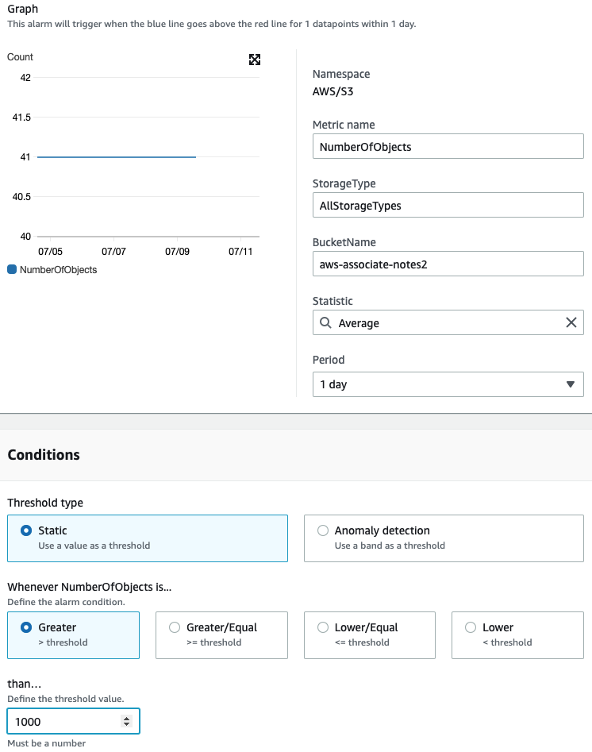

Instead of a static threshold we can use **anomaly detection** to detect when the number of objects in the S3 bucket is outside of its normal range.

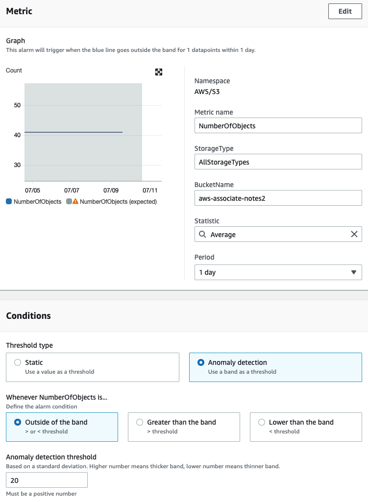

We can also use math to make new metrics from other metrics.

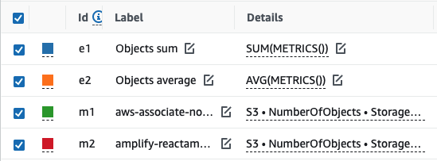

Here are graphs of the sum and the average of the tracked metrics.

We can use the sum as the metric in our alarm. **See that multiple metrics can be combined into a single alarm using math**.


*   **metric alarms**
    *   Monitor a single CloudWatch metric.
    *   CloudWatch metrics can be based on a static threshold (like )

# Containers on AWS

## What is a Container?

A container is a standardized unit of software development that contains everything that your software application needs to run, including relevant code, runtime, system tools, and system libraries. Containers are created from a read-only template called an image.

Images are typically built from a Dockerfile, which is a plaintext file that specifies all of the components that are included in the container. After being built, these images are stored in a registry where they then can be downloaded and run on your cluster. For more information about container technology, see Docker basics for Amazon ECS.

Multiple docker containers can run on an operating system using docker.

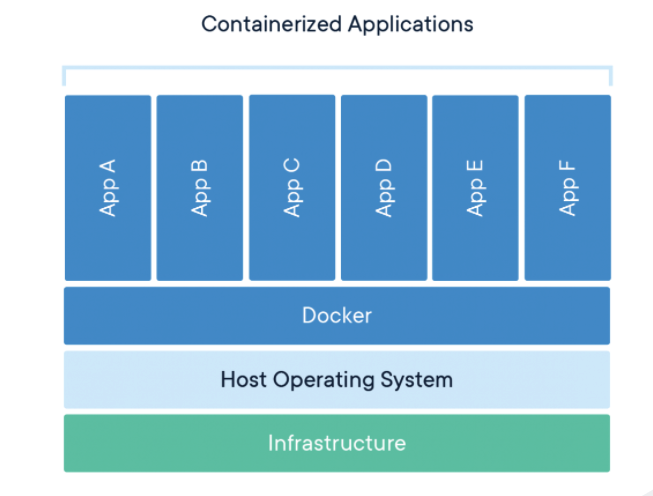

### Dockerfiles, Images, Containers

A **dockerfile** specifies the resources for a **docker image**, you *build* the dockerfile to create a docker image.

*   The dockerfile is just a text file.
*   The docker image is like a template for the actual container.
*   When you *run* a docker image, you have a container.

Container images are stored in a container registry. The container images that ECS runs to create containers come from a container registry. Some popular registry options are Amazon ECR, Docker Hub, GitHub Container Registry, or self-hosted.

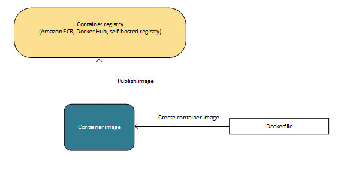

## What is Amazon Elatic Container Service?

Amazon Elastic Container Service is for managing containers on AWS. There are two ways to run ECS, Fargate (EC2) or ontop of EC2 instances that you manage.

Here is a diagram.

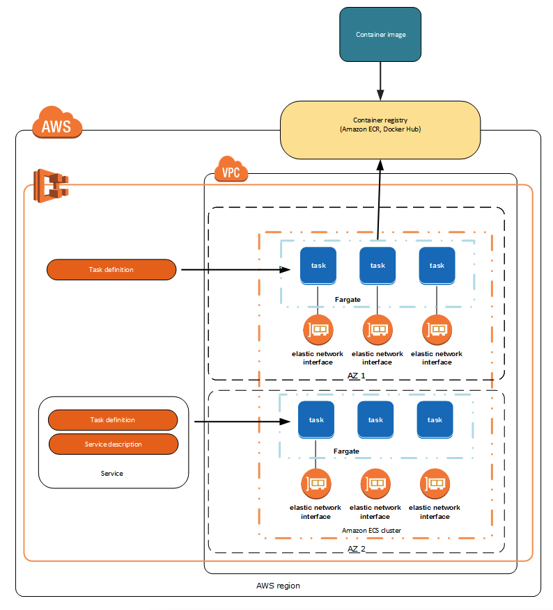

Let's explain what all this means.

### Task definitions, tasks

**Task definitions** describe the containers that form your application. It also defines other parameters like what ports should be open and what data volumes should be used with the task.

A **task** is an instantiation of a task definition. Multiple identical tasks can be created from a task definition.

The diagram below is complicated, let's break it down.

*   A container image is uploaded to a container registry.
*   This container is running on Fargate, so there are no EC2 instances in the diagram.
*   The task definition can create multiple identical tasks.
    *   Each task can run multiple docker containers within.

## Fargate vs. EC2 Backed

Containers are run on clusters, which are logical groupings of tasks.

There are two ways to run a cluster:

*   **AWS Fargate**: You don't have to manage the underlying EC2 instances.
*   **EC2 backed**: You can manage the backing EC2 instances.

# Snow

## What is the AWS Snow Family?

### Storage

The AWS Snow Family is a collection of physical devices that help migrate large amounts of data into and out of the cloud without depending on networks.

How this works is AWS sends you a computer and you send it back to them. This might sound slow, but it can be faster than sending it over the internet if you have enough data. It would take 13 days to send 100TB at 100MB/s!

That is why it makes sense to physically ship your data to Amazon and they will put it in S3 for you.

### Compute

Since they are sending you a computer, you can use it as a computer. Maybe you want to process your data while it is in transit.

## Members of the Snow Family

### AWS Snowcone

Snowcone is small rugged, edge compute and data storage product. You can use Snowcone to collect, process, and transfer data to AWS, either offline by shipping the device, or online with AWS DataSync. Running applications in austere (non-data center) edge environments or where there is lack of consistent network connectivity or low bandwidth can be challenging because these locations often lack the space, power, and cooling needed for data center IT equipment. With 2 vCPUs, 4 GB of memory, and 8 TB of usable storage, Snowcone can run edge computing workloads that use Amazon EC2 instances, and store data securely.

### AWS Snowball

AWS Snowball, a part of the AWS Snow Family, is an edge computing, data migration, and edge storage device that comes in two options. Snowball Edge Storage Optimized devices provide both block storage and Amazon S3-compatible object storage, and 40 vCPUs. They are well suited for local storage and large scale-data transfer. Snowball Edge Compute Optimized devices provide 52 vCPUs, block and object storage, and an optional GPU for use cases like advanced machine learning and full motion video analysis in disconnected environments. You can use these devices for data collection, machine learning and processing, and storage in environments with intermittent connectivity (like manufacturing, industrial, and transportation) or in extremely remote locations (like military or maritime operations) before shipping them back to AWS. These devices may also be rack mounted and clustered together to build larger temporary installations.

Snowball supports specific Amazon EC2 instance types and AWS Lambda functions, so you can develop and test in the AWS Cloud, then deploy applications on devices in remote locations to collect, pre-process, and ship the data to AWS. Common use cases include data migration, data transport, image collation, IoT sensor stream capture, and machine learning.

### AWS Snowmobile

AWS Snowmobile is an Exabyte-scale data transfer service used to move extremely large amounts of data to AWS. You can transfer up to 100PB per Snowmobile, a 45-foot long ruggedized shipping container, pulled by a semi-trailer truck.

When your Snowmobile is on site, AWS personnel will work with your team to connect a removable, high-speed network switch from Snowmobile to your local network and you can begin your high-speed data transfer from any number of sources within your data center to the Snowmobile. After your data is loaded, Snowmobile is driven back to AWS where your data is imported into Amazon S3.

Snowmobile uses multiple layers of security to help protect your data including dedicated security personnel, GPS tracking, alarm monitoring, 24/7 video surveillance, and an optional escort security vehicle while in transit. All data is encrypted with 256-bit encryption keys you manage through the AWS Key Management Service (KMS) and designed for security and full chain-of-custody of your data.
