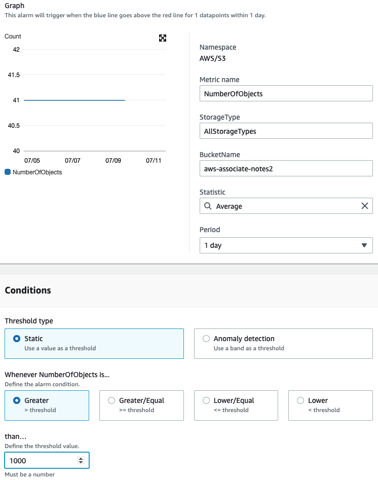
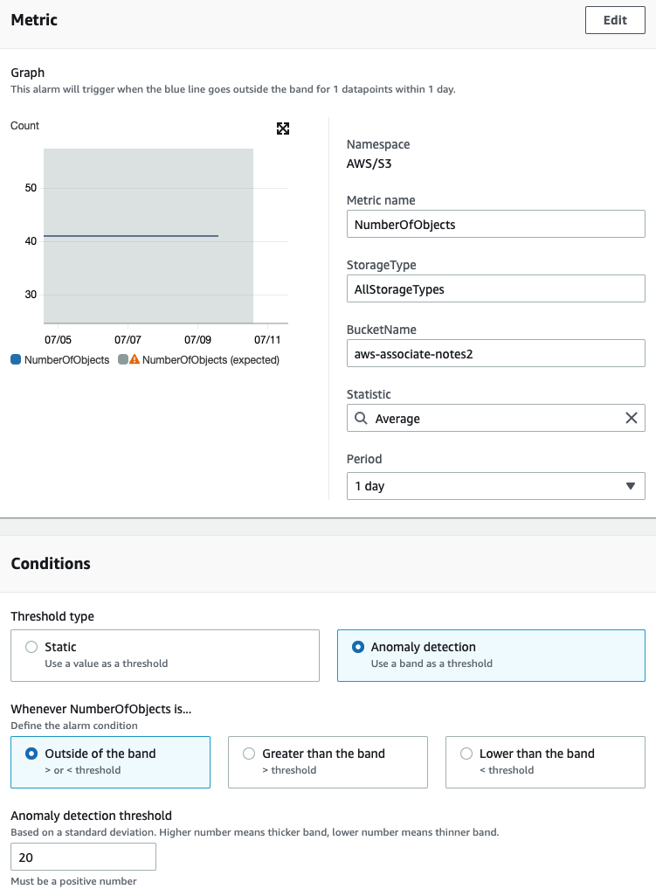

# Cloudwatch

## What is CloudWatch?

Amazon CloudWatch monitors your Amazon Web Services (AWS) resources and the applications you run on AWS in real time.

## Metrics

A metric represents a time-ordered set of data points that are published to CloudWatch. Think of a metric as a variable to monitor, and the data points as representing the values of that variable over time. For example, the CPU usage of a particular EC2 instance is one metric provided by Amazon EC2. The data points themselves can come from any application or business activity from which you collect data.

### Namespaces

Metrics belong to namespaces. This is used to isolate metrics from eachother so that you don't mistakenly aggregate metrics from different applications into the same statistic.

### Dimensions

A dimension is a name/value pair that is part of the identity of a metric. You can assign up to 10 dimensions to a metric. Every metric has specific characteristics that describe it, and you can think of dimensions as categories for those characteristics.

**Metrics are uniquely defined by a name, a namespace, and zero or more dimensions.**

https://docs.aws.amazon.com/AmazonCloudWatch/latest/monitoring/cloudwatch_concepts.html#Metric

## Dashboards

You can use CloudWatch dashboards to create customized views of the metrics and alarms for your AWS resources.

There is no limit on the number of CloudWatch dashboards in your AWS account.

All dashboards are global, not Region-specific.

You can share your CloudWatch dashboards with people who do not have direct access to your AWS account. This enables you to share dashboards across teams, with stakeholders, and with people external to your organization. You can even display dashboards on big screens in team areas, or embed them in Wikis and other webpages.

## Logs

https://docs.aws.amazon.com/AmazonCloudWatch/latest/logs/WhatIsCloudWatchLogs.html

You can use Amazon CloudWatch Logs to monitor, store, and access your log files from Amazon Elastic Compute Cloud (Amazon EC2) instances, AWS CloudTrail, Route 53, and other sources.

<!-- TODO Cloudwatch log agents -->

## High-Resolution Metrics

Metrics are either -

- **High resolution**: data granularity of one minute.
- **Standard resolution**: data granularity of one second.

Every PutMetricData call for a custom metric is charged, so calling PutMetricData more often on a high-resolution metric can lead to higher charges.

## EC2

By default, Amazon EC2 sends metric data to CloudWatch in 5-minute periods. To send metric data for your instance to CloudWatch in 1-minute periods, you can **enable detailed monitoring on the instance**. Detailed monitoring can more quickly prompt an autoscaling event.

Some information about your EC2 instance is not collected by default, you will need to enable the **CloudWatch agent** to collect these metrics. Some metrics you will need the agent for are memory and disk metrics.

https://docs.aws.amazon.com/AmazonCloudWatch/latest/monitoring/Install-CloudWatch-Agent.html

https://docs.aws.amazon.com/AmazonCloudWatch/latest/monitoring/metrics-collected-by-CloudWatch-agent.html

https://docs.aws.amazon.com/AWSEC2/latest/UserGuide/using-cloudwatch.html

## Using Amazon CloudWatch dashboards

Amazon CloudWatch dashboards are customizable home pages in the CloudWatch console that you can use to monitor your resources in a single view, even those resources that are spread across different Regions.

You can use CloudWatch dashboards to create customized views of the metrics and alarms for your AWS resources.

## Alarms

### Overview

These are the conditions of an alarm that will be triggered when my S3 bucket averages more than 1000 objects on a day. This is a **static threshold**.

Instead of a static threshold we can use **anomaly detection** to detect when the number of objects in the S3 bucket is outside of its normal range.

We can also use math to make new metrics from other metrics.

Here are graphs of the sum and the average of the tracked metrics.

We can use the sum as the metric in our alarm. **See that multiple metrics can be combined into a single alarm using math**.

- **metric alarms**
  - Monitor a single CloudWatch metric.
  - CloudWatch metrics can be based on a static threshold (like )
