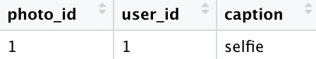
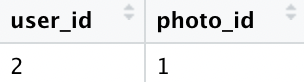
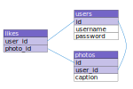

# Databases

## What is a database?

Let's talk about the basic types of databases before we talk about AWS services. Databases help you store and interact with data.

Let's review some different types of databases.

### What is a relational database?

Skip this section unless you need a review of relational databases.

Consider an application like Instagram. There are users. Users can take photos. People can like the photos. How should we represent this? The relational database solution is to have separate tables that represent the users, photos, and likes.

The user table contains our users. If we have two users, one cat and one dog, the user table might look like this:


Suppose we have one photo, a selfie uploaded by the cat. Notice that we use the `id` from the user table to indicate the owner of the photo. This is why it is a **relational** database.



The user with id 2 likes the photo with id 1, the dog liked the cat's selfie.



Here is a rough diagram of the way things work. ER diagrams are outside the scope of discussion so some conventions are not followed.



### What is a NoSQL database?

NoSQL databases don't have the rectangular tables and relationships between tables the way relational databases do. Instead of relationships we store data in the way that it is queried. When we view a user's profile we need their photos, so maybe photos should be included with the username.

```json
[
  {
    "id": 1,
    "username": "cat",
    "password": "meow",
    "photos": [
      {
        "id": 1,
        "caption": "selfie",
      }
    ]
  },
  {
    "id": 2,
    "username": "dog",
    "password": "woof",
    "likes": [
      1
    ]
  },
]
```

Since the dog had no photos there is no attribute for photos. Different items have different fields. We say that it is **schemaless**.

**NoSQL drawbacks:** We have all the data as the relational database previously discussed. A pain point of NoSQL databases is the lack of flexibility in querying. Consider that we can easily access all the likes of the dog, but that our photo doesn't know who liked it. We could solve this by including likes on the photo, but what if a user has 1000 photos that each get 1,000,000 likes? Should we really store all that information in one place? NoSQL requires a different way of thinking. You need to know how you are going to use your data before setting up the tables. With relational databases SQL gives us a lot of flexibility in how we write our queries.

**NoSQL advantages:** NoSQL databases are built for scalability and performance. With relational databases you typically scale vertically by using a bigger machine to host your database. With NoSQL you scale horizontally, adding servers as you need. 

### Online transaction processing vs. Online analytical processing

OLTP is used to manage transactional workloads, like inserting a new user when a user signs up to a website. OLAP is used to run complex queries for things like business intelligence.

Relational databases can be row oriented or column oriented.

Row oriented databases store entries of a row in adjacent memory locations. This makes it easy to insert/delete rows for transactional (OLTP) workloads.


Column oriented databases store entries of a column in adjacent memory locations. Analytical workloads (OLAP) often involve operations on a column like summing it or grouping it, so this architecture is optimized for analytical workloads.


Amazon Redshift is column oriented, databases on RDS are row oriented. You can learn more about Redshift architecture [here](https://docs.aws.amazon.com/redshift/latest/dg/c_columnar_storage_disk_mem_mgmnt.html)

### What is an in-memory database

Computers have memory (RAM) and storage. Storage is either Solid-state drive (SSD) or hard disk drive (HDD).

Memory is everything your computer is currently thinking about. Storage is everything your computer knows. 

It is fast to access something from memory, it is slow to access something from storage. This is why more RAM speeds up computers, they access storage less often.

Relational databases store all of their data in storage, what if we had a database that stored everything in memory? We would have faster access times. This is why we use in-memory databases (IMDB).


## Amazon Relational Database Service (RDS)

Amazon RDS manages a server with a relational database installation and automates common tasks like performing backups or patching software. AWS doesn't even give you access to the shell for the machine RDS is running on, you won't need it.

RDS supports the following databases:

* MySQL
* MariaDB
* Oracle
* SQL Server
* PostgreSQL

Let's talk features.

### Scalability

* Scale storage on the fly with no downtime.
* **Read replicas** - a read-only replica of your database. Serve high-volume read traffic from the read-replica and the primary database for increased overall read capacity.


### Availability and durability

* Backups allow you to restore your database from a previous state. There are two types.
  * Automated backups: Allows you to recover to a point in time from the retention period The retention period can be configured to be up to 35 days.
  * Database snapshots: User initiated snapshots that are stored in S3 and must be manually deleted.
* You can deploy to multiple availability zones (AZs). This makes a primary instance in one AZ which replicates data to an instance in another AZ. If the infrastructure in your primary AZ fails, RDS will automatically transfer to the replica with minimal downtime.


### Security

**At rest and in transit**: You are able to encrypt data at rest with keys managed in AWS Key Management Service (KMS). On a database running with encryption, data in the underlying storage is encrypted, as well as the data in automated backups, read replicas, and snapshots. Data in transit is secured using SSL.

**Network isolation**: Run your database in a VPC. Use network access control lists (NACLs) and security groups to control traffic to the RDS instance.

### Manageability

AWS provides Amazon CloudWatch metics for your database instances at no extra charge.

[RDS features overview](https://aws.amazon.com/rds/features/)

## Aurora

Amazon Aurora is a relational database engine that is compatible with MySQL and PostgreSQL. Aurora isn't competing with RDS, Aurora is an instance type on RDS just like PostgreSQL. There are some special features of Aurora that improve upon the other RDS instance types.

### Performance

Aurora offers five times the performance of MySQL and three times the performance of PostgreSQL.

### Hardware and Scaling

**You can scale storage**: You do not provision storage for Aurora. Aurora will automatically scale storage up to 128TB with a minimum storage of 10GB depending on your use. Scaling does not impact performance.

**You can scale compute**: Compute depends on your instance type. You can change the instance type of an existing DB but this will impact availability during the maintenance period.

### Backup and Restore

As with all RDS instances, we can take snapshots to backup the database. For Aurora specifically, automated backups are always enabled.

### High Availability and Replication

Aurora is fault tolerant. Your database is replicated 6 ways across 3 availability zones. Aurora is also self healing, like wolverine.

You can make Aurora replicas for read-scaling or high availability. You can also make MySQL replicas if you are using Aurora MySQL. The main benefit of MySQL replicas is that they can be cross-region, and Aurora replicas are confined to the region of the instance. I am not sure the use case for MySQL replicas because for cross region replication I would use Aurora Global Database.

Aurora Global Database allows for you to physically replicate your database across regions. It is recommended for low-latency global reads and disaster recovery.

### Security

You can encrypt data at rest and in transit as you would in other RDS instance types.

### Aurora Serverless

There is a serverless offering that autoscales to your required capacity. Ideal for unknown or variable workloads.

https://aws.amazon.com/rds/aurora/faqs/

## Amazon DynamoDB

Amazon DynamoDB is a serverless NoSQL database. With RDS you have to choose what kind of EC2 instance Amazon will manage your database on. With DynamoDB we don't worry about that. We can scale up and down as much as we like without worrying about the size of an EC2 instance.

We don't have to worry about availability or fault tolerance, they are built right in.

### Performance

DynamoDB Accelerator (DAX) is an in-memory cache that improves read performance up to 10x, bringing read times from single digit millisecond to microseconds.


DynamoDB global tables replicate tables across regions to scale capacity and allow local access in selected regions for improved performance.

### Serverless

* DynamoDB has two modes, on-demand and provisioned. 
  * Use on-demand if you don't know how much peak capacity you need.
  * Provisioned will automatically scale, but up to a certain maximum capacity (unlike on-demand). Provisioned capacity is more cost effective when you are able to predict the max capacity.
* When data is modified in DynamoDB you can capture it in a DynamoDB **stream**. This will capture writes/updates/deletes from a DynamoDB table. You can use the stream with AWS Lambda to perform actions in response to changes made to the table.

### Enterprise Ready

* Supports transactions. These are multiple batched operations that either all succeed or all fail. Useful when a single operation needs to make multiple operations.
* Data is encrypted by default with AWS Key Management Service (KMS).
* Point-in-time recovery allows you to continuously back up your data for a specified retention period.
* On-demand backup and restore lets you manually create a full backup of your tables.

[DynamoDB features overview]()


## Amazon Redshift

Redshift is a column oriented database used for OLAP. 

You load data into Redshift tables, and then you do parallel processing on the loaded data to perform the analytics. 

The leader node sends instructions to the compute nodes which perform the instructions in parallel on data from the client applications.


You can query live databases using federated queries. You can query from S3 without loading into Redshift tables using Amazon Redshift Spectrum.

You pay per hour with the payment rate determined by the size of your compute node.

## Elasticache

Amazon Elasticache makes it easy to host an in-memory database (IMDB) in the cloud. It supports two types of databases, Redis and Memcached. Redis is more popular and more flexible than Memcached.

Elasticache gives you sub-millisecond performance. Use Elasticache if you need low latency. 

You can cache results from a database to improve latency and performance, or you can just use it as a fast key-value store for things like user-authentication tokens.

Elaticache stores simple data, not complex related tables.

To set up Elasticache you tell AWS what size instance you need. They provision the resources and manage the installation for you (installing patches, server maintenance, etc).

Elasticache resources belong to a VPC so you can use security groups and network ACLs to control access to your instance.

Elasticache is integrated with CloudWatch for monitoring.

## Other Databases

I'm not so sure about what kind of questions you might see. 

* AWS Database Migration Service is for migrating databases.
* Amazon Neptune is a graph database for highly relational data
* Amazon Elasticsearch Service allows you to perform a fuzzy search on JSON data.