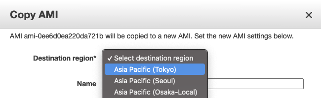
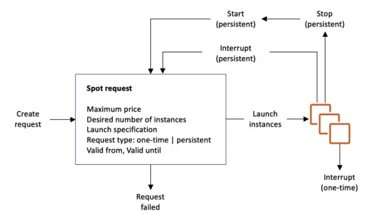
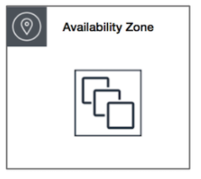

# EC2

## What is Amazon EC2

Amazon EC2 lets you run servers in the cloud. Before the cloud you would have a physical server, now you can just rent one from Amazon.

## AMI

When you launch an instance you select an Amazon Machine Image (AMI) which packages up an operating system and any additional software you will need for your server. Below is an image of part of the selection menu, see that we can select a Linux or Windows instance type.


If you start with a basic AMI and customize it for your needs, you can take that EC2 instance and make an AMI from it so you don't have to do that work all over again.

Your AMI can only be used by instances in the region it lives in (AMIs are stored in S3). You can easily copy an AMI to another region by right clicking on it.



[AMI docs](https://docs.aws.amazon.com/AWSEC2/latest/UserGuide/AMIs.html)

## Instance IP Addressing

There are two types of IP addresses used by AWS, IPv4 and IPv6. We focus on IPv4. There are private IPv4 addresses which can communicate with your machine within the AWS infrastructure. There are public IP addresses which can communicate with your machine over the web.

Whenever you stop your machine AWS disassociates the public IPv4 address. When you start it again, you will receive a new address. You shouldn't rely on your instance having an unchanging public IPv4 address. If you really need a constant IPv4 address you can use an **elastic IP**, which associates a constant public IPv4 address with your instance. **Private IPv4 addresses are always constant.**

[Instance IP Addressing Docs](https://docs.aws.amazon.com/AWSEC2/latest/UserGuide/using-instance-addressing.html)

## User data scripts

When you launch an instance in Amazon EC2, you have the option of passing a **user data** script to the instance that will run when the machine starts. This way instead of making several AMIs that are similar, you can have a single AMI and use the user data script to customize it.

[EC2 Instance Metadata](https://docs.aws.amazon.com/AWSEC2/latest/UserGuide/ec2-instance-metadata.html)

You don't need to understand the script below, but in the docs they paste this to the console at instance creation to configure an instance as a web server.

```
#!/bin/bash
yum update -y
amazon-linux-extras install -y lamp-mariadb10.2-php7.2 php7.2
yum install -y httpd mariadb-server
systemctl start httpd
systemctl enable httpd
usermod -a -G apache ec2-user
chown -R ec2-user:apache /var/www
chmod 2775 /var/www
find /var/www -type d -exec chmod 2775 {} \;
find /var/www -type f -exec chmod 0664 {} \;
echo "<?php phpinfo(); ?>" > /var/www/html/phpinfo.php
```

[Run commands on your Linux instance at launch, AWS docs](https://docs.aws.amazon.com/AWSEC2/latest/UserGuide/user-data.html)

## Instance purchasing options

- **On-Demand Instances**
  - Pay for compute capacity by the second with no long-term commitments
  - Use On-Demand Instances for applications with short-term, irregular workloads that cannot be interrupted.
  - [On-Demand Instances docs](https://docs.aws.amazon.com/AWSEC2/latest/UserGuide/ec2-on-demand-instances.html)
- **Reserved Instances**
  - Pay up front for an EC2 instance, reserving it for a 1 to 3 year period.
  - Do this for predictable workloads that will run for a long time.
  - The longer you reserve the instance for and the more you pay up front (you can do a partial upfront) the larger the discount.
  - There are different types of reserved instances.
    - **Standard Reserved Instances** work as described above.
    - **Convertible Reserved Instances** allow you to change instance type. You get a smaller discount for this.
    - **Scheduled Reserved Instances** let you reserve within a part of the day. [This seems to be discontinued](https://docs.aws.amazon.com/AWSEC2/latest/UserGuide/ec2-scheduled-instances.html).
  - [Reserved Instances docs](https://docs.aws.amazon.com/AWSEC2/latest/UserGuide/ec2-reserved-instances.html)
- **Spot Instances** are unused EC2 instances that are available for less than the On-Demand price.
  - The spot price is the hourly price set by Amazon EC2 based on the supply and demand for EC2 instances.
  - You set a maximum price per hour you are willing to pay. When the spot price exceeds your maximum price then your EC2 instance is terminated.
  - Well suited for things that don't need to run long, like data analysis or batch processing.
  - [Spot Instances docs](https://docs.aws.amazon.com/AWSEC2/latest/UserGuide/using-spot-instances.html)
- **Dedicated Hosts** are physical servers with EC2 instance capacity fully dedicated for your use. You do not share the physical hardware with anyone else.
  - Some software licenses might need you to know information about your instances per-socket, per-core, or per-VM. Dedicated hosts provides visibility into these things for compliance with licenses.
  - [Dedicated Hosts docs](https://docs.aws.amazon.com/AWSEC2/latest/UserGuide/dedicated-hosts-overview.html)
- **Dedicated instances** are Amazon EC2 instances dedicate to a single customer. The instance may share hardware with other non-dedicated instances from the same account.
  - [Dedicated Instances docs](https://docs.aws.amazon.com/AWSEC2/latest/UserGuide/dedicated-instance.html)

Dedicated Hosts and Dedicated Instances can both be used to launch Amazon EC2 instances onto physical servers that are dedicated for your use.

Here are some differences between the two:


[Dedicated Hosts docs](https://docs.aws.amazon.com/AWSEC2/latest/UserGuide/dedicated-hosts-overview.html)

## More on Spot Instances

### Spot Fleet

A Spot Fleet is a collection, or fleet, of Spot Instances, and optionally On-Demand Instances. This fleet of instances tried to meet the capacity specified in the spot fleet request.

A Spot Instance pool is a set of unused EC2 instances with the same instance type (for example, m5.large), operating system, Availability Zone, and network platform.

The allocation strategy for the Spot Instances in your Spot Fleet determines how it fulfills your Spot Fleet request from the possible Spot Instance pools represented by its launch specifications. The following are the allocation strategies that you can specify in your Spot Fleet request:

- `lowestPrice`
  - The Spot Instances come from the pool with the lowest price. This is the default strategy.
- `diversified`
  - The Spot Instances are distributed across all pools.
- `capacityOptimized`
  - The Spot Instances come from the pool with optimal capacity for the number of instances that are launching.

[Spot Fleet docs](https://docs.aws.amazon.com/AWSEC2/latest/UserGuide/spot-fleet.html)

### Request Types

In the diagram below we see that a spot request launches instances. The spot request has a **request type** which determines if launched instances restart or not upon interruption (if the spot price goes above your max price or if you manually interrupt). Instances launched from a one-time spot request will go away, but instances launched from a persistent spot request will be restarted by the spot request. Thus, if you wish to terminate a persistent spot instance you must first terminate the request.



[Spot Instance request docs](https://docs.aws.amazon.com/AWSEC2/latest/UserGuide/spot-requests.html)

## EC2 Instance Types

Instances are classified as general purpose, compute optimized, memory optimized, and storage optimized.

- **General purpose** instances are not specialized for particular use case. **M** type instances are good all-around. **T** type instances are burstable
- **Compute optimized** instances are for high computational loads requiring more CPU. Consider using for scientific computing. **C** type instances.
- **Memory optimized** have higher RAM for applications that need more memory like in-memory caches. **R** type instances.
- **Storage optimized** instances are made for workloads with lots of sequential read/write access on data sets in local storage. Good for data warehousing applications like MapReduce and Hadoop. **D, H, and I** type instances.

[EC2 Instance Types docs](https://docs.aws.amazon.com/AWSEC2/latest/UserGuide/instance-types.html)

To determine if your instance is over-provisioned you can use the [AWS Compute Optimizer](https://docs.aws.amazon.com/AWSEC2/latest/UserGuide/ec2-instance-recommendations.html).

## Placement groups

EC2 tries to spread out your instances to minimize correlated failures. You can use placement groups to influence the placement of a group of interdependent instances to meet the needs of your workload. Types of placement groups are -

- **Cluster** packs instances close together inside an Availability Zone. This strategy enables workloads to achieve the low-latency network performance necessary for tightly-coupled node-to-node communication that is typical of HPC applications.
- **Partition** multiple groups of instances where each group belongs to the same rack in a data center, and different groups belong to different racks. This strategy is typically used by large distributed and replicated workloads, such as Hadoop, Cassandra, and Kafka.
- **Spread** strictly places a small group of instances across distinct underlying hardware to reduce correlated failures.

### Rules and Limitations

### Cluster

Use this for low network latency and high network throughput. Correlated failures are a risk.



### Partition

Use this for distributed data processing. If a rack fails a group of instances may go offline.

You can only have 7 partitions per AZ, so if there are three AZ in a region we can have 21 partitions. Within each partition you can have as many instances as allowed by your account.


### Spread

Each instance is on its own rack. Each rack has its own power source and network.

You can only have 7 _instances_ per AZ, so if there are six AZ in a region we can have 42 partitions. Within each partition you can have many instances.


[Placement Groups docs](https://docs.aws.amazon.com/AWSEC2/latest/UserGuide/placement-groups.html)

## Network Interfaces

An elastic network interface is a logical networking component in a VPC that represents a virtual network card. It can include the following attributes:

- A primary private IPv4 address from the IPv4 address range of your VPC
- One or more secondary private IPv4 addresses from the IPv4 address range of your VPC
- One Elastic IP address (IPv4) per private IPv4 address
- One public IPv4 address
- One or more IPv6 addresses
- A MAC address

You can create a network interface, attach it to an instance, detach it from an instance, and attach it to another instance. The attributes of a network interface follow it as it's attached or detached from an instance and reattached to another instance. When you move a network interface from one instance to another, network traffic is redirected to the new instance.

Each instance has a default network interface, called the primary network interface. You cannot detach a primary network interface from an instance.

```mcq
answers:
  - 'Yes'
  - 'No'
correct_idx: 0
id: 33694418-b93b-4c47-8f0c-11asdfa8f58e
prompt: This is EC2 question 1
solution: Yes
```

```mcq
answers:
  - 'Yes'
  - 'No'
correct_idx: 0
id: 33694418-b9b-4c47-8f0c-11asdfa8f58e
prompt: This is EC2 question 2
solution: Yes
```

```mcq
prompt: EC2 question
solution: This is where the solution is. Click to start editing.
answers:
  - Correct 1
  - Correct 2
  - You can output the JSX or YAML code for the problem to use in your program.
  - Thanks!
  - For multiple selection questions there are two correct answers usually.
correct_idx:
  - 0
  - 1
id: ikWqalIZYBF83ZIfk4QNH
```
