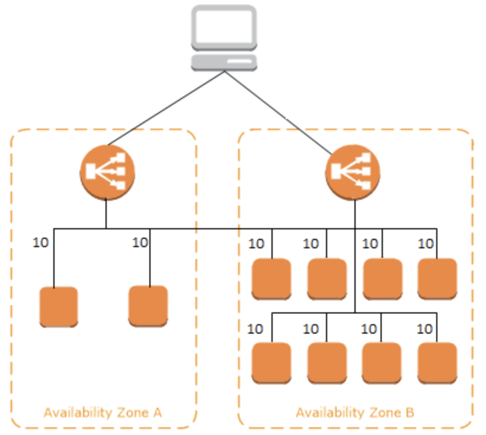

# Elastic Load Balancing

## What is Elastic Load Balancing?

Elastic Load Balancing automatically distributes your incoming traffic across multiple targets, such as EC2 instances, containers, and IP addresses, in one or more Availability Zones. It monitors the health of its registered targets, and routes traffic only to the healthy targets.

Using a load balancer increases the availability and fault tolerance of your applications.

Elastic Load Balancing supports the following load balancers: Application Load Balancers, Network Load Balancers, Gateway Load Balancers, and Classic Load Balancers.

* Application Load Balancer
  * Supports HTTP and HTTPS (Secure HTTP) protocols.
  * Advanced routing.
* Network Load Balancer
  * Supports TCP, UDP, and TCP+UDP (Layer 4), and TLS listeners.
  * It is architected to handle millions of requests/sec, sudden volatile traffic patterns and provides extremely low latencies.
* Classic load balancer
  * HTTP, HTTPS (Secure HTTP), SSL (Secure TCP) and TCP protocols.

## ALB

A load balancer serves as the single point of contact for clients. Clients send requests to the load balancer, and the load balancer sends them to targets, such as EC2 instances. To configure your load balancer, you create target groups, and then register targets with your target groups. You also create listeners to check for connection requests from clients, and listener rules to route requests from clients to the targets in one or more target groups.

HTTP requests and HTTP responses use header fields to send information about the HTTP messages. HTTP headers are added automatically. Header fields are colon-separated name-value pairs that are separated by a carriage return (CR) and a line feed (LF). A standard set of HTTP header fields is defined in RFC 2616, Message Headers. There are also non-standard HTTP headers available that are automatically added and widely used by the applications. Some of the non-standard HTTP headers have an X-Forwarded prefix. Application Load Balancers support the following X-Forwarded headers.

### Rule condition types

Rule condition types
The following are the supported condition types for a rule:

host-header
Route based on the host name of each request. For more information, see Host conditions.

http-header
Route based on the HTTP headers for each request. For more information, see HTTP header conditions.

http-request-method
Route based on the HTTP request method of each request. For more information, see HTTP request method conditions.

path-pattern
Route based on path patterns in the request URLs. For more information, see Path conditions.

query-string
Route based on key/value pairs or values in the query strings. For more information, see Query string conditions.

source-ip
Route based on the source IP address of each request. For more information, see Source IP address conditions.

The X-Forwarded-For request header is automatically added and helps you identify the IP address of a client when you use an HTTP or HTTPS load balancer. Because load balancers intercept traffic between clients and servers, your server access logs contain only the IP address of the load balancer.

### Lambda

You can register your Lambda functions as targets and configure a listener rule to forward requests to the target group for your Lambda function.

### Sticky

By default, an Application Load Balancer routes each request independently to a registered target based on the chosen load-balancing algorithm. However, you can use the sticky session feature (also known as session affinity) to enable the load balancer to bind a user's session to a specific target. This ensures that all requests from the user during the session are sent to the same target. This feature is useful for servers that maintain state information in order to provide a continuous experience to clients. To use sticky sessions, the client must support cookies.

### Misc

In order to make sure that ELB can scale to whatever volume you have and burst to whatever volume you suddenly encounter, AWS assigns a 'static' DNS hostname (e.g. MyDomainELB-918273645.us-east-1.elb.amazonaws.com). That hostname points to multiple IP addresses. 

https://stackoverflow.com/questions/35313134/assigning-static-ip-address-to-aws-load-balancer

### Troubleshooting

If your target is not in the `InService` state it might be failing health checks, it won't be in service until it passes at least one health check. Make sure that your security group and NACL allow for access from the ALB.

There are different error codes you can get.

* 4xx errors are caused by the client. 
  * `HTTP 400: Bad request` 
  * `HTTP: 401: Unauthorized`
* 5xx errors means that there is a server-side error.
  * `HTTP 500: Internal server error`
  * `HTTP 503: Service unavailable` - this means your load balancer has no registered targets.

## NLB

* Network Load Balancer
  * Supports TCP, UDP, and TCP+UDP (Layer 4), and TLS listeners.
  * It is architected to handle millions of requests/sec, sudden volatile traffic patterns and provides extremely low latencies.

## Cross-zone load balancing

If cross-zone load balancing is enabled, each of the 10 targets receives 10% of the traffic. This is because each load balancer node can route its 50% of the client traffic to all 10 targets.

If not enabled then each AZ gets 50% of the traffic which doesn't evenly distribute across targets.

With Application Load Balancers, cross-zone load balancing is always enabled.

With Network Load Balancers and Gateway Load Balancers, cross-zone load balancing is disabled by default. After you create the load balancer, you can enable or disable cross-zone load balancing at any time.

When you create a Classic Load Balancer, the default for cross-zone load balancing depends on how you create the load balancer. With the API or CLI, cross-zone load balancing is disabled by default. With the AWS Management Console, the option to enable cross-zone load balancing is selected by default. After you create a Classic Load Balancer, you can enable or disable cross-zone load balancing at any time.