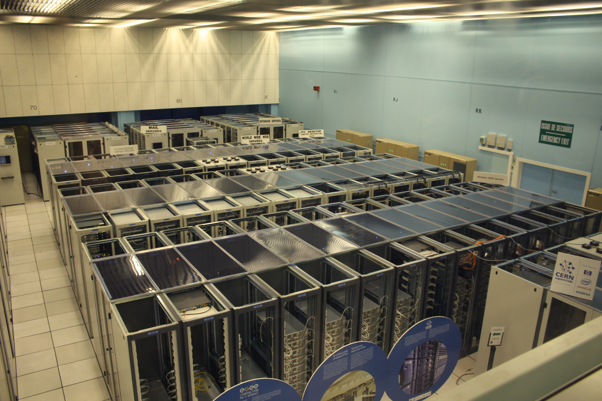
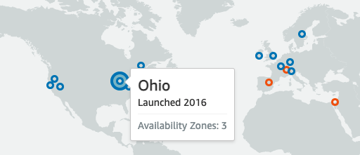
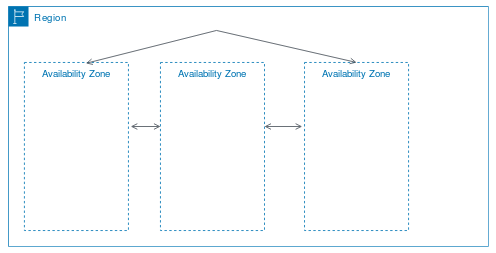

# AWS Global Infrastructure

## Traditional Data Centers

Companies used to manage a room full of machines that did their computation. This is called a data center. Having a data center at the company means the company has to manage all of the machines. Below is a picture of a data center from the Wikipedia page on data centers.

## Benefits of AWS

With AWS, Amazon manages the data center and customers are able to rent and manage their infrastructure over the web. Here are six advantages of cloud computing [from AWS](https://docs.aws.amazon.com/whitepapers/latest/aws-overview/six-advantages-of-cloud-computing.html)

- **Trade capital expense for variable expense** – Instead of having to invest heavily in data centers and servers, only pay for what you want when you want it.
- **Benefit from massive economies of scale** – Providers such as AWS can achieve high economies of scale, which translates into lower pay as-you-go prices.
- **Stop guessing capacity** – Eliminate guessing on your infrastructure capacity needs.
- **Increase speed and agility** – New IT resources are only a click away, which means that you reduce the time to make those resources available to your developers from weeks to just minutes.
- **Stop spending money running and maintaining data centers** – Cloud computing lets you focus on your own customers, rather than on the heavy lifting of racking, stacking, and powering servers.
- **Go global in minutes** – Easily deploy your application in multiple regions around the world with just a few clicks.

## Global Infrastructure

### Regions

AWS has data centers around the world. These data centers are clustered into **regions**. A cluster of data centers is called a **region**. In the diagram below each blue dot represents a region.

### Availability zones

A region contains between 2-5 **availability zones**. An Availability Zone (AZ) is one or more discrete data centers with redundant power, networking, and connectivity in an AWS Region. All AZs in an AWS Region are interconnected with high-bandwidth, low-latency networking, over fully redundant, dedicated metro fiber providing high-throughput, low-latency networking between AZs. All traffic between AZs is encrypted.

If an application is partitioned across AZs, companies are better isolated and protected from issues such as power outages, lightning strikes, tornadoes, earthquakes, and more. AZs are physically separated by a meaningful distance, many kilometers, from any other AZ, although all are within 100 km (60 miles) of each other.
