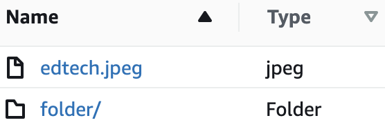

# S3

## Buckets

You can upload files (pictures, videos, data sets) to an Amazon S3 **bucket**. Generally you will access the buckets and their contents programatically, but you can also use the AWS console to work with the buckets. The buckets must have a name that follows certain conventions:

[Buckets Overview docs](https://docs.aws.amazon.com/AmazonS3/latest/userguide/UsingBucket.html)

* Bucket names must be between 3 and 63 characters long.
* Bucket names can consist only of lowercase letters, numbers, dots (.), and hyphens (-).
* Bucket names must begin and end with a letter or number.
* Bucket names must not be formatted as an IP address (for example, 192.168.5.4).
* Bucket names must be unique within a partition. A partition is a grouping of Regions. AWS currently has three partitions: aws (Standard Regions), aws-cn (China Regions), and aws-us-gov (AWS GovCloud [US] Regions).

[Bucket Naming docs](https://docs.aws.amazon.com/AmazonS3/latest/userguide/bucketnamingrules.html)

## Objects

The files you store in S3 are called ***objects**. Each object has a **key** which is a unique identifier within the bucket, and associated with this key is the **value** which is the stored file. Objects can be up to 5TB in size but you can only upload 5GB at a time so you will need to use a multi-part upload for files larger than 5GB. 

[Using Objects ](https://docs.aws.amazon.com/AmazonS3/latest/userguide/UsingObjects.html)

Folders can be represented within S3 - 

S3 only supports buckets and objects (the files are a lie!) and this filesystem interface is a convenience provided to users of the console.

The object key refers to the entire "path" to the object. 
So the object key might be "folder/fileInFolder.png".

[Object Keys docs](https://docs.aws.amazon.com/AmazonS3/latest/userguide/object-keys.html)

## Versioning

Versioning helps you prevent accidentally overwriting or deleting a file. In a versioning enabled bucket if the same object key is written multiple times, all of the writes will be recorded with the same object key but having different version IDs.

If you delete an object in a versioned S3 bucket all of the values associated with that key will remain, but a delete marker will be placed to indicate that the object has been deleted. To restore the data you can simply delete the delete marker. If you want to actually delete something from a versioned bucket you will have to specify which version you want to delete.

If you enable versioning on a previously unversioned bucket then all existing objects will be given a version ID of null. Once you enable versioning on a bucket it can no longer go back to the unversioned state, but you can suspend versioning. Suspended versioning buckets retain all existing versions but otherwise behave like an unversioned bucket.

[Versioning docs](https://docs.aws.amazon.com/AmazonS3/latest/userguide/Versioning.html)

## Data Consistency

In December 2020 AWS delivered strong read-after-write consistency for PUTs and DELETEs on objects. This means that if you upload a new object then you can immediately read it from the bucket.

This is how you want things to behave but before this S3 had eventual consistency, which meant you often had to wait a moment to guarantee you had fresh data.

If you have concurrent requests things can get tricky. Like if you are uploading a new version at the same time as you are requesting the object, you might get either the old or the new version.

Bucket configurations are eventually consistent, so if you enable versioning you might want to wait 15 minutes before starting to upload things.

[Welcome to S3 docs](https://docs.aws.amazon.com/AmazonS3/latest/userguide/Welcome.html)

## Encryption

You can do encryption server-side or client-side, and within server-side you have several options.

* Server-Side
  * SSE-S3: Server-Side Encryption with Amazon S3-Managed Keys 
  * SSE-KMS: Server-Side Encryption with Customer Master Keys (CMKs) Stored in AWS Key Management Service
  * SSE-C: Server-Side Encryption with Customer-Provided Keys
* Client-Side

[Encryption docs](https://docs.aws.amazon.com/AmazonS3/latest/userguide/UsingEncryption.html)

### SSE-S3

S3 encrypts each object with a key, which is also encrypted by a master key, and the master key is regularly rotated. Uses AES-256 encryption. 

When using the REST API for S3 set the `x-amz-server-side-encryption` request header to `AES-256` to let AWS know that they need to server-side encrypt the object before uploading it to S3.

[SSE docs](https://docs.aws.amazon.com/AmazonS3/latest/userguide/UsingServerSideEncryption.html)

### SSE-KMS

When using the REST API set the `x-amz-server-side-encryption` request header to `aws:kms`. 

AWS KMS is the AWS Key Management Service and it manages keys for encryption. Using this service to encrypt S3 data via SSE-KMS will provide a better audit trail than using SSE-S3.

[KMS docs](https://docs.aws.amazon.com/AmazonS3/latest/userguide/UsingKMSEncryption.html)

### SSE-C

You must provide the encryption key to AWS when you upload the object. If you want to read the encrypted object, you must provide the same key! If you forget which key goes to which object or lose the key, the object is lost forever.

You must use HTTPS because you are sending sensitive information (the key) over the internet.

[Customer keys docs](https://docs.aws.amazon.com/AmazonS3/latest/userguide/ServerSideEncryptionCustomerKeys.html)

### Client-Side Encryption

You write an encrypted object to S3 and store it there. You can retrieve this encrypted object and decrypt it yourself.

[Client-side encryption docs](https://docs.aws.amazon.com/AmazonS3/latest/userguide/UsingClientSideEncryption.html)

## Managing Access

By default only the person creating an S3 bucket has access to it. To allow other users access we can either make the bucket more permissive or give the other user elevated permissions.

The bucket controls who accesses it via **Bucket ACLs** and **Bucket Policys**. Objects within the bucket can have an **Object ACL** that specifies who can access.

Users are granted privileges through AWS IAM. 

[S3 Access Control](https://docs.aws.amazon.com/AmazonS3/latest/userguide/access-control-overview.html)

## CORS

Suppose we have a website https://example1.com, and someone else has an api at https://example2.com/api. The owner of example2.com might not want you using their api. By default the browser will prevent this unless the owner of example2.com explicitly allows it using CORS (Cross Origin Resource Sharing). 

The implementation is that the browser will send a preflight request asking example2.com/api if example1.com can access it.

If you get an error like `No 'Access-Control-Allow-Origin' header is present on the requested resource.` then you have a CORS error.

[An article on CORS]: # (https://medium.com/@buddhiv/what-is-cors-or-cross-origin-resource-sharing-eccbfacaaa30)

