# VPC

## VPC Basics

Amazon Virtual Private Cloud (Amazon VPC) enables you to launch AWS resources into a virtual network that resembles a traditional network that you'd operate in your own data center, with the benefits of using the scalable infrastructure of AWS.

VPCs are specific to a region but they span all the availability zones in a region. You can make subnets of a VPC, subnets are specific to availability zones. Multiple VPCs can be in the same region.

<!-- TODO: make horizontal svg of below -->

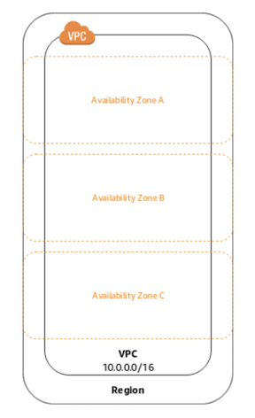

When you create a VPC, you must associate an IPv4 CIDR block for it. The CIDR block must contain between 16 and 65,536 IP addresses (netmasks of `/28` and `/16` respectively). If you see a question asking about CIDR block sizes know that it is between `/28` and `/16`.

Your CIDR block must be in the private IP ranges:

- `10.0.0.0 – 10.255.255.255`, CIDR `10.0.0.0/8`
- `172.16.0.0 – 172.31.255.255`, CIDR `172.16.0.0/12`
- `192.168.0.0 – 192.168.255.255`, CIDR ` 192.168.0.0/16`

You can add multiple CIDR blocks to your VPC. CIDR blocks must not overlap, so we can't have both `10.0.0.0/28` and `10.0.0.1/28` in a VPC. You can never modify the range of an existing CIDR block

[How VPC works, AWS docs](https://docs.aws.amazon.com/vpc/latest/userguide/how-it-works.html)

## Subnet Sizing

When you divide an IP network into multiple parts, each part is called a subnet. The subnets will have CIDR blocks that are subsets of the CIDR block of the VPC.

The number of available IPv4 addresses in your subnet's CIDR block is not exactly what you think it would be.

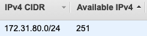

In a `/24` IPv4 we would expect for there to be 256 addresses, 2^(32-24) = 2^8 = 256. The reason there are only 251 available is that AWS reserves some of the IP addresses for it's own use.

The 5 missing IP addresses are reserved as follows:

- `172.31.80.0` is used as the network address
- `172.31.80.1` is reserved for the VPC router
- `172.31.80.2` is reserved for the DNS
- `172.31.80.3` is reserved by AWS for future use
- `172.31.80.255` is the network broadcast address. AWS does not support broadcast so this is reserved.

If a question asks what IP addresses you can use, the first 4 IP addresses are reserved, as well as the last one. Be able to calculate the CIDR range for a simple example like 10.0.0.0/24.

[VPC subnets docs](https://docs.aws.amazon.com/vpc/latest/userguide/VPC_Subnets.html)

## Route Tables

Route tables specify how network traffic from subnets or the internet should be directed within the VPC.

Every subnet needs to be associated with a route table. This route table will direct traffic to the subnet.

### Example

Here is a route table for a VPC with CIDR block `172.31.0.0/16`.

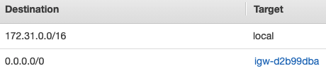

This route table is saying that traffic to the VPC (`172.31.0.0/16`) is local to the VPC and that traffic elsewhere (`0.0.0.0/0`) goes to `igw-d2b99dba` (this is an **internet gateway**, we discuss this later).

### Implied Routing

At the beginning of this section we said that every subnet needs to be associated with a route table, but our route table didn't say anything about any subnets. This is explained by the following image:

<!-- TODO: Is this explained well? Maybe not. -->

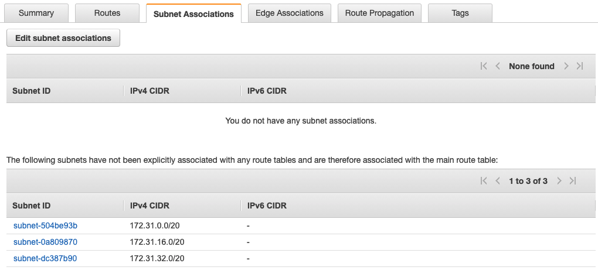

There is a **main route table** which is created when a new VPC is created. You do not need to explicitly associate a new subnet with a route table, there is an automatic association with the main route table.

You do not need to explicitly define routes for traffic _between subnets_. The VPC knows what ranges your subnets exist on and will take care of this for you.

### Main Route Table

Let's go over an example on the main route table from the AWS documentation.

Suppose you have two subnets and two route tables. Initially, both subnets have an implicit association with Route Table A, the main route table. We want to change both subnets to be associated with route table B.

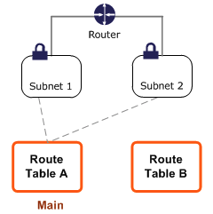

We can create an explicit association between subnet 2 and Route Table B.

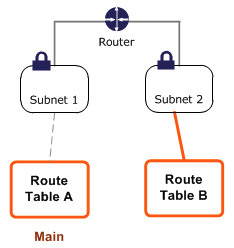

We can change the main route table from A to B, which will update the implicit association of subnet 1 from A to B.


We can delete the explicit association between subnet 2 and table B, and it will still have an implicit association with the route table.


A route table can be associated with multiple subnets, but a subnet cannot be associated with multiple route tables.

[Route tables docs](https://docs.aws.amazon.com/vpc/latest/userguide/VPC_Route_Tables.html)

## Internet Gateway

Instances that have a public IP address in a subnet can connect to the internet need an internet gateway. Let's look at a route table again to see how this works:


Traffic going to the private IPs of the CIDR block for the VPC stay `local` to the VPC. All other traffic goes to `igw-d2b99dba`, which is an internet gateway that will take this traffic to the internet. If this rule is not in the route table, then traffic will not get routed to the internet gateway.

The internet gateway horizontally
scales, is redundant, and is highly available. AWS manages these things. You do not need to worry about availability or scalability of your internet gateways.

[Internet Gateway docs](https://docs.aws.amazon.com/vpc/latest/userguide/VPC_Internet_Gateway.html)

## NAT devices

Network address translation (**NAT**) devices allow other devices with private IPs to initiate outbound connections to the internet over IPv4 while preventing unwanted inbound connections

NAT devices are either a **NAT instance** or a **NAT gateway**. The NAT instance does translation on an EC2 instance, the NAT gateway is managed by Amazon. NAT gateways are now the preferred NAT device (they are better and easier to use), but NAT instance questions can still appear on the exam.

### NAT instances

Here is a diagram of a database in a private subnet (has no public IP) connecting to the internet using a NAT instance:

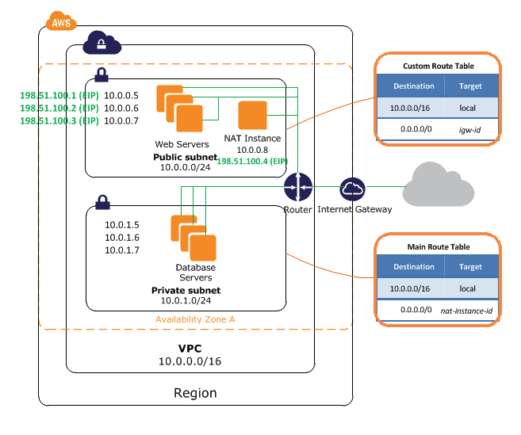

Here is how it works -

1. The Database servers send a request to a public IP.
2. This public IP is in the range `0.0.0.0/0` and so it is routed to the NAT instance at `nat-instance-id`.
3. The NAT instance sends this request to the public IP and receives a response back.
4. The NAT instance sends the response back to the database servers on the private subnet at `10.0.1.0/24`.

Some additional information

- The NAT instance has an elastic IP (an IP address that doesn't change), this is required.
- You must disable **source/destination checks** on your EC2 instance when using it as a NAT instance. These check if the instance is either the source or the destination of network traffic before accepting the traffic. The NAT instance is not the source/destination of the traffic, it is a middleman between the private subnet and the internet.

### NAT Gateway

The NAT Gateway is managed by AWS, there is no EC2 instance to manage. NAT gateways automatically scale up to 45 Gbps, but the NAT instance's scalability dependens on the EC2 instance type.

Just like NAT instances, the NAT gateway has an elastic IP and lives in a public subnet.

<!-- TODO: What the hell am I on about in the paragraph below -->

The NAT gateway is specific to the availability zone and is redundant within that availability zone. You can use a single NAT gateway for all of your needs in a region, but this means you might lose connectivity for all regional services if the AZ containing the NAT gateway loses connectivity. The architecture is more resilient when each availability zone has a dedicated NAT gateway.

A comparison of the NAT gateways and instances from the AWS documentation:


[NAT docs](https://docs.aws.amazon.com/vpc/latest/userguide/vpc-nat.html)

## Egress-only internet gateways

When we have a public IPv4 address or an IPv6 address and our EC2 instance is connected to a public gateway, we can send and receive traffic from the internet.

People on the internet can send us traffic even if we didn't ask for the traffic. This can be solved for IPv4 by having an instance in a private subnet that is attached to a NAT gateway.

For IPv6 traffic we can connect to an egress-only internet gateway (instead of a plain internet gateway). This will prevent unwanted traffic from reaching our instance. It will allow us to send requests to the internet and receive responses though.

[Egress-only internet gateway docs](https://docs.aws.amazon.com/vpc/latest/userguide/egress-only-internet-gateway.html)

## Security Groups

A security group is a network device that decides what incoming and outgoing traffic to allow or to disallow for an EC2 instance.

<!-- TODO: An image here, showing all the stuff more diagram like -->

Which CIDR blocks and security groups can communicate with an EC2 instances, as well as what ports this communication can happen on.

<!-- TODO: Lab -->

Multiple EC2 instances can have the same security group as long as they are in the same VPC. All EC2 instances must have a security group.

Here are some properties of security groups:

- You can specify allow rules but not deny rules, traffic that is not explicitly allowed is denied.
- There are separate rules for inbound and outbound traffic.
- Security groups are stateful. Suppose they sent a request to an IP address. They will be able to receive the response to their request even if they do not have an inbound security rule that would allow the traffic. Likewise they can respond to requests that are received even if there is no explicit rule allowing the traffic.

### Default Security Groups

- When creating a new security group no inbound traffic is allowed by default. This is in contrast to the default security group that is created when a VPC is created, which does allow inbound traffic **only for traffic originating from the same security group**.
- For both custom and default security groups, all outbound traffic is allowed by default.

[Security Groups docs](https://docs.aws.amazon.com/vpc/latest/userguide/VPC_SecurityGroups.html)

## Network ACL (Network Access Control List)

<!-- TODO: Image -->

Network ACLs are also a type of firewall. Here are some differences between the network ACL and the security group.

- Network ACLs are applied to subnets, security groups are applied to EC2 instances.
  - Because network ACLs are applied to subnets, they are evaluated before the security group is evaluated. Traffic must make it through both the security group and network ACL.
- The network ACL is stateless, responses to inbound traffic are subject to the rules for outbound traffic. This is not true for security groups, where the outbound rules don't apply for responses to received inbound traffic (it is stateful).
- The network ACL can have both allow and deny rules. The security group only has allow rules and everything not explicitly allowed is implicitly denied.

Here are some similarities between the network ACL and the security group.

- They both control access within a VPC.
- All subnets must be associated with a network ACL, just like all EC2 instances must have a security group.
- You can associate a network ACL with multiple subnets, just like a security group can be associated with multiple EC2 instances.
- VPCs come with a default network ACL, just like EC2 instances come with a default security group.

The default NACL that comes with the VPC allows all traffic in and out of the VPC. Custom NACLs deny all inbound and allow all outbound traffic by default.

Since there are both allow and deny rules we need a way of deciding which rule is correct when the rules conflict. To solve this, there are numbers associated with each rule, and the lowest number wins. These numbers are from 1 to 32766. AWS recommends spacing out your rules, so that you can put a rule between your rules (ex. put rule 15 between rule 10 and rule 20) in case you need to.

[Network ACL docs](https://docs.aws.amazon.com/vpc/latest/userguide/vpc-network-acls.html)

## VPC Endpoints

VPC endpoints enable private connections between your VPC and AWS services.

Suppose we want to access an AWS service (like a database) from a private subnet. This service has a public IP that we can use. So we can use a NAT gateway to communicate from our private subnet to the internet which will communicate with the database.

It would be better to talk to AWS services over a private IP address and not send any traffic into the public internet. **This is the purpose of VPC endpoints.**

VPC endpoints are horizontally scaled, redundant, and highly available.

There are two types of VPC endpoints, the type you should use is determined by the service you are accessing:

- Gateway endpoints are used for S3 and DynamoDB (two AWS services discussed in depth later).
- Interface endpoints are used for other services.

[VPC endpoint docs](https://docs.aws.amazon.com/vpc/latest/userguide/vpc-endpoints.html)

## AWS PrivateLink (VPC endpoint services)

You can privately connect to AWS services using VPC endpoints. You can build your own **VPC endpoint services** on AWS and connect to them with a VPC endpoint just like you would connect to a prebuilt AWS service.

In the diagram below our VPC endpoint service is in VPC B. The dashed line around it is the service provider, `vpce-svc-1234`. The ENI of subnet A can access the network load balancer using an interface endpoint. If the network load balancer has instances spread across multiple availability zones then the solution will be fault-tolerant.

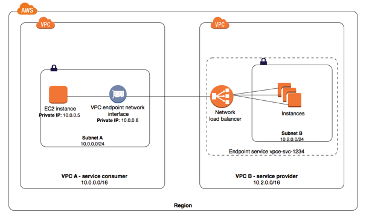

[VPC endpoint services docs](https://docs.aws.amazon.com/vpc/latest/userguide/endpoint-service.html)

## VPC Peering

VPC peering is a connection between two VPCs that allows you to route traffic between them privately. It allows you to communicate between different VPCs as if they were in the same VPC. You can create a VPC peering connection between your own VPCs, or with a VPC in another AWS account. The VPCs can be in different regions (also known as an inter-region VPC peering connection). The VPCs must have non-overlapping CIDR blocks.

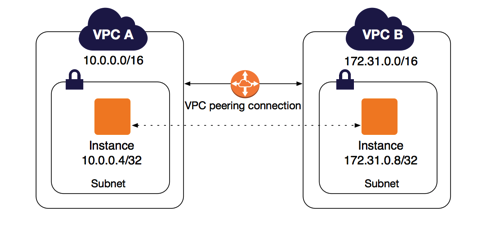

VPC peering is not transitive. In the image below, VPC A is connected to both VPC B and VPC C, but **VPC B is not connected to VPC C**.

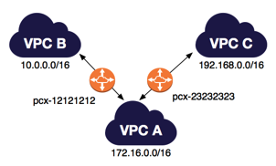

When peering VPCs you need to update your route tables to route traffic in the appropriate private IP range to the VPC peering connection.

[VPC Peering docs](https://docs.aws.amazon.com/vpc/latest/peering/what-is-vpc-peering.html)

## Bastion Hosts

<!-- TODO: What is the level of depth I should give here? -->

There is a situation where you want to provide SSH access to linux instances, but want to keep these instances in private subnets. There is a blog post from Amazon talking about how to use **bastion hosts** that are instances in a public subnet that have are allowed to SSH into the private subnet. This is like a layer of indirection regarding SSH. Apparently this was all necessary to log who was coming into the instances in the private subnet and having them in a public subnet might be too much of a security risk?

I think VPC flow logs is the best way to log, so why bastion hosts?

[Bastion hosts blog post](https://aws.amazon.com/blogs/security/how-to-record-ssh-sessions-established-through-a-bastion-host/)

## What is a VPN?

https://docs.aws.amazon.com/whitepapers/latest/aws-vpc-connectivity-options/network-to-amazon-vpc-connectivity-options.html

Although _VPN connection_ is a general term, we now use VPN connection to refers to the connection between your VPC and your own on-premises network. Site-to-Site VPN supports Internet Protocol security (IPsec) VPN connections.

These options are useful for integrating AWS resources with your existing on-site services (for example, monitoring, authentication, security, data or other systems) by extending your internal networks into the AWS Cloud.

## Site to Site VPN Connection

You can configure a connection between a VPC and a local network, like your home network or the network for your office.

The diagram below shows the connection between an AWS VPC and an on-premises network.


Let's talk about some of the components:

- **VPN connection**: A secure connection between AWS and your on premises network.
- **Virtual private gateway**: Sets up a secure connection on the AWS side.
- **Customer gateway device**: A physical device that you set up on-premises to connect with AWS.
- **Customer gateway**: A resource that you create in AWS that represents the customer gateway device in your on-premises network.

https://en.wikipedia.org/wiki/IPsec

[//]: # "https://docs.aws.amazon.com/vpn/latest/s2svpn/VPC_VPN.html"
[//]: # "https://docs.aws.amazon.com/vpn/latest/s2svpn/Examples.html"

[Site-to-Site VPN docs](https://docs.aws.amazon.com/vpn/latest/s2svpn/VPC_VPN.html)

## Transit Gateway

Transit gateway lets you connect VPN, direct connect, VPCs and more.

Suppose we want to connect many VPCs together. VPC peering is not transitive so it would take 45 connections to connect 10 VPCs together. With the transit gateway we connect all of the VPCs to the transit gateway and they can all talk to eachother. In the diagram below everyone can talk to eachother because the transit gateway allow transitive connection.


You can connect multiple user gateways to the transit gateway to implement redundancy and failover.


Transit gateways support IP multicast. This means that you can send multiple IP addresses at once to a transit gateway and it will communicate to them all. This is not supported in our other routing methods.

[Transit gateway docs](https://docs.aws.amazon.com/vpc/latest/tgw/what-is-transit-gateway.html)

## Direct Connect

AWS direct connect allows you to connect to AWS while bypassing your internet service provider. This is done to improve bandwidth and latency for things like working with large data sets or real-time data feeds.


[Direct Connect docs](https://docs.aws.amazon.com/directconnect/latest/UserGuide/Welcome.html)

## VPN CloudHub

Cloudhub is specifically for the case when you need to connect multiple on-premise data centers to AWS, **but the transit gateway is more general**.

VPN cloudhub allows for multiple site-to-site connections and for communications between your sites. Sites must have non-overlapping IP ranges.

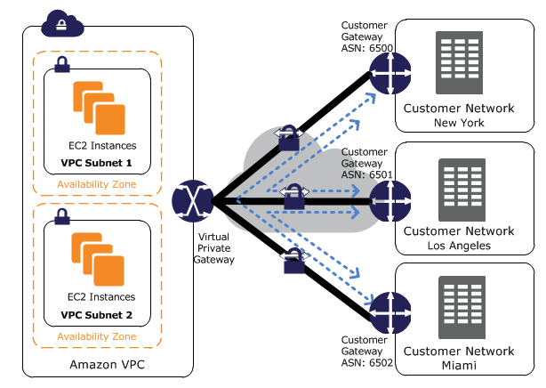

[VPN CloudHub docs](https://docs.aws.amazon.com/vpn/latest/s2svpn/VPN_CloudHub.html)

## VPC Flow Logs

VPC flow logs help you track information about IP traffic going in and out of the network interfaces (ENIs) of your VPC.

Flow logs can help you -

- Troubleshoot issues with security group rules
- Monitor traffic reaching an instance

You can create flow logs at varying levels of granularity: for a VPC, subnet, or a network interface. If you create a flow log for a subnet or VPC all the ENIs in the VPC/subnet will be monitored. You can write flow logs either to an S3 bucket (a storage service) or to Cloudwatch (a cloud monitoring service).

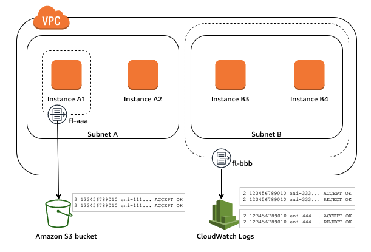

[Flow logs docs](https://docs.aws.amazon.com/vpc/latest/userguide/flow-logs.html)

```mcq
answers:
  - 'Yes'
  - 'No'
correct_idx: 0
id: 33694418-b9dfs3b-4c47-8f0c-11asdfa8f58e
prompt: This is VPC question 1
solution: Yes
```

```mcq
answers:
  - 'Yes'
  - 'No'
correct_idx: 0
id: 33694418-b9b-4c47hfg-8f0c-11asdfa8f58e
prompt: This is VPC question 2
solution: Yes
```
